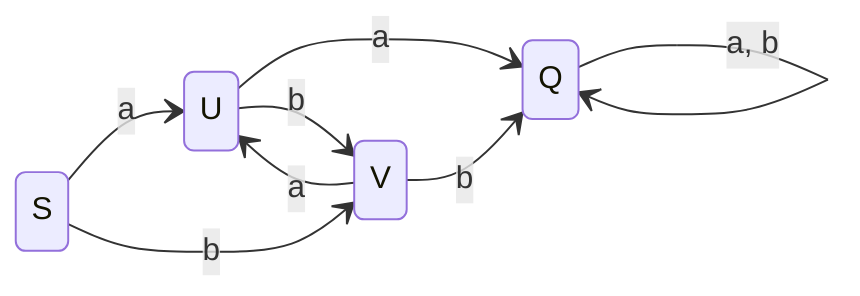
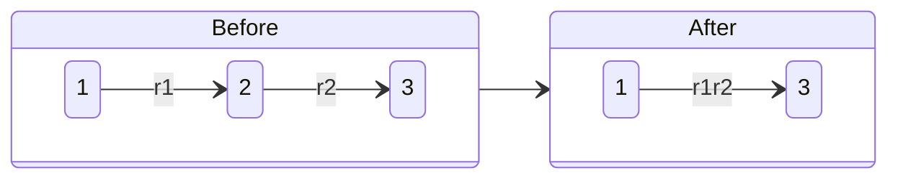
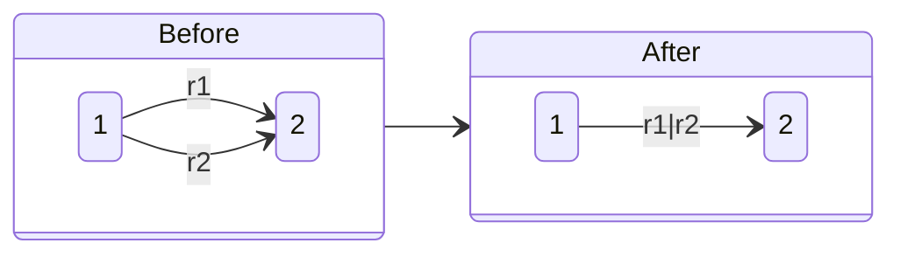
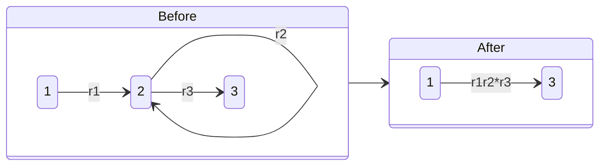
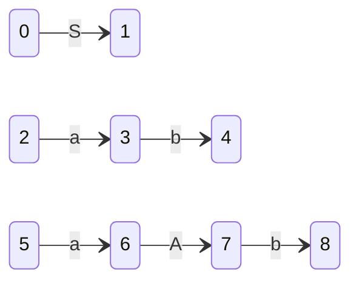
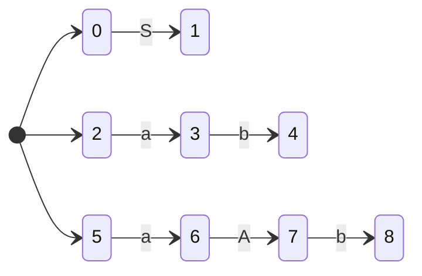

# COMPILERS

[toc]

## 引论

### 编译过程

1. 词法分析
   : 读入源程序，识别单词，包括标识符、保留字、算符、界符等
2. 语法分析
   : 将单词序列分解为各类语法短语（语法单位），包括程序、语句、表达式等
3. 语义分析
   : 审查源程序有无语义错误，如类型审查、下标越界等
4. 中间代码生成
   : 将源程序变为内部表示形式，称为中间语言（中间代码），如“四元式”：$(\text{运算符},\text{运算对象 1},\text{运算对象 2},\text{结果})$
5. 代码优化
   : 对中间代码进行变换或改造，使目标代码更为高效
6. 目标代码生成
   : 将中间代码变换成绝对指令代码/可重定位的指令代码/汇编指令代码

### PL/0 语言编译系统

1. PL/0 编译程序
   : 将 PL/0 程序编译为类 P-code 程序

   1. 词法分析程序
   2. 语法语义分析程序
   3. 代码生成程序

2. 类 P-code 解释程序（类 P-code 虚拟机）
   : 解释类 P-code 程序

- 源语言：PL/0
- 目标语言：类 P-code
- 编译程序的实现语言：C/Pascal/Java 等

### 扩展巴科斯范式 (Extended Backus–Naur Form, EBNF)

- `<>`：必选项，语法构造成分
- `::=`：定义
- `|`：或
- `{}`：可重复 0 次到任意多次
- `[]`：任选项，可出现一次或不出现

## 文法和语言

### 符号和符号串

- 字母表（符号集）
  : 由符号组成的非空有穷集合。包括字母、数字、专用符号、保留字等
- 符号串
  : 字母表中的符号组成的任意有穷序列。允许空符号串，记为 $\varepsilon$

指定字母表 $\Sigma$，$\Sigma^*$ 表示 $\Sigma$ 上所有有穷长符号串的集合，称为 $\Sigma$ 的**闭包**

$$ \Sigma^*=\bigcup_{n=0}^\infty\Sigma^n $$

$\Sigma^+$ 表示 $\Sigma$ 上所有非空有穷长符号串的集合，称为 $\Sigma$ 的**正闭包**

$$ \Sigma^+=\bigcup_{n=1}^\infty\Sigma^n $$

### 文法和语言的形式定义

文法

$$ G=G[S]=(V_N,V_T,P,S) $$

- $V_N$：非终结符集
- $V_T$：终结符集
- $V=V_N\cup V_T$：文法 $G$ 的字母表
- $P\subseteq\{\alpha\to\beta|\alpha,\beta\in V^*,\alpha\text{ 至少包含一个非终结符}\}$：规则的集合
- $S$：非终结符，至少在一条规则中作为左部出现，称作识别符（开始符）
- $V_N,V_T,P$ 均为非空有穷集
- $V_N\cap V_T=\varnothing$

文法 $G$ 所产生的语言

$$ L(G)=\{x|x\in V_T^*,S\xRightarrow{*}x\} $$

### 文法的类型

- 0 型文法

  $$ P_0\subseteq\{\alpha\to\beta|\alpha,\beta\in V^*,\alpha\text{ 至少包含一个非终结符}\} $$

- 1 型文法（上下文有关）

  $$
  \begin{aligned}
      P_1\subseteq&\{\alpha\to\beta|\alpha,\beta\in V^*,|\beta|\geq|\alpha|\}\cup\{S\to\varepsilon\}\\
      =&\{\alpha_1A\alpha_2\to\alpha_1\beta\alpha_2|A\in V_N,\alpha_1,\alpha_2,\beta\in V^*,\beta\neq\varepsilon\}\cup\{S\to\varepsilon\}
  \end{aligned}
  $$

- 2 型文法（上下文无关）

  $$ P_2\subseteq\{\alpha\to\beta|\alpha\in V_N,\beta\in V^*\} $$

- 3 型文法（正规文法）

  $$ P_3\subseteq\{A\to aB|A,B\in V_N,a\in V_T^*\}\cup\{A\to a|A\in V_N,a\in V_T^*\} $$

:memo: $P_3\subseteq P_2\subseteq P_1\subseteq P_0$

### 上下文无关文法及其语法树

#### 语法树（推导树）

- 结点的标记为字母表中的一个符号
- 根结点为 $S$
- 分支结点 $\in V_N$
- 若分支结点 $A$ 的直接子孙依次为 $A_1,A_2,\cdots,A_k$，则 $A\to A_1A_2\cdots A_k\in P$

从左至右依次读出叶子结点的标记，得到的句型即语法树的结果

最左（最右）推导
: 每一步推导都对最左（最右）的非终结符进行替换。最右推导又称**规范推导**，得到的句型称为**右句型**或**规范句型**

一个文法中存在句子对应不同的语法树，称这个文法是**二义**的  
产生一个语言的所有文法都是二义的，称这个语言是**先天二义**的

### 句型的分析

#### 自上而下的分析方法

[具体章节](#自顶向下语法分析方法)

回溯：待替换的非终结符存在 $n$ 条规则 $A\to \alpha_1|\alpha_2|\cdots|\alpha_n$，从中随机挑选，若错误则退回。代价高，效率低

#### 自下而上的分析方法

[具体章节](#自底向上优先分析)

设 $\alpha\beta\delta$ 是文法 $G$ 的一个句型，若 $S\xRightarrow{*}\alpha A\delta$ 且 $A\xRightarrow{+}\beta$，称 $\beta$ 是 $\alpha\beta\delta$ 相对于非终结符 $A$ 的**短语**  
若有 $A\implies\beta$，称 $\beta$ 是 $\alpha\beta\delta$ 相对于规则 $A\to\beta$ 的**直接短语**（**简单短语**）  
右句型的直接短语称为该句型的**句柄**

无二义文法中，右句型有唯一句柄，为其所有直接短语中最左侧的一个

### 文法的实用限制

文法中不含有害规则和多余规则

- 有害规则：形如 $U\to U$，会引起文法的二义性
- 多余规则

  - 不可到达：非终结符 $A$ 不在任何规则的右部出现
  - 不可终止：无法从非终结符 $A$ 推导出终结符号串

## 词法分析

词法分析程序设计为语法分析程序的子程序  
识别出单词后返回**单词符号**，发现词法错误返回出错信息

单词符号分类

- 关键字（保留字）：如 `begin`、`end`、`if` 等
- 标识符：如常量名、变量名、过程名等
- 常数
- 运算符：如 `+-*<>=` 等
- 界符：如 `,;()` 等

单词符号可表示为 $(\text{种别},\text{值})$，其中标识符可表示为 $(\text{标识符},\text{标识符在符号表中位置的指针})$

### 单词的形式化描述工具

#### 正规文法

#### 正规式（正则表达式）

设字母表为 $\Sigma$，辅助字母表 $\Sigma'=\{\varnothing,\varepsilon,|,\cdot,*,(,)\}$

1. $\varepsilon$ 和 $\varnothing$ 都是 $\Sigma$ 上的正规式，分别表示正规集 $\{\varepsilon\}$ 和 $\varnothing$
2. $\forall a\in\Sigma$，$a$ 是 $\Sigma$ 上的一个正规式，表示正规集 $\{a\}$
3. 若 $e_1$ 和 $e_2$ 都是 $\Sigma$ 上的正规式，分别表示正规集 $L(e_1)$ 和 $L(e_2)$，则 $(e_1)$、$e_1|e_2$、$e_1\cdot e_2$、$e_1^*$ 都是正规式，分别表示正规集 $L(e_1)$、$L(e_1)\cup L(e_2)$、$L(e_1)L(e_2)$、$(L(e_1))^*$
4. 由有限次上述步骤定义的表达式为 $\Sigma$ 上的正规式，表示 $\Sigma$ 上的正规集

设 $r,s,t$ 为正规式

- $r|s=s|r$
- $r|(s|t)=(r|s)|t$
- $(rs)t=r(st)$
- $r(s|t)=rs|rt,(s|t)r=sr|tr$
- $\varepsilon r=r,r\varepsilon=r$
- $r|r=r$

#### 正规文法和正规式的等价性

令 $V_T=\Sigma$，$S$ 为识别符  
设 $x,y$ 为正规式

正规式 $\leftrightarrow$ 正规文法

|    正规式    |      文法产生式       |
| :----------: | :-------------------: |
|    $A=xy$    | $A\to xB$<br>$B\to y$ |
|   $A=x^*y$   |   $A\to xA\vert y$    |
| $A=x\vert y$ |    $A\to x\vert y$    |

### 有穷自动机

#### 确定的有穷自动机（Deterministic Finite Automata, DFA）

$$ M=(K,\Sigma,f,S,Z) $$

- $K$：有穷集，每个元素称为一个状态
- $\Sigma$：有穷字母表，每个元素称为一个输入符号。又称输入符号表
- $f:K\times\Sigma\to K$：例 $f(k_i,a)=k_j$，当前状态为 $k_i$，输入字符 $a$ 时转换为下一状态 $k_j$，$k_j$ 称为 $k_i$ 的一个后继状态
- $S\in K$：唯一的初态
- $Z\subseteq K$：终态集。终态又称可接受状态（结束状态）

扩充 $f$ 定义

- $\forall Q\in K,f(Q,\varepsilon)=Q$
- $\forall Q\in K,t_1\in\Sigma,t_x\in\Sigma^*,f(Q,t_1t_x)=f(f(Q,t_1),t_x)$

状态图（状态转换图）表示  
结点表示状态，有向弧表示输入符号



矩阵表示  
行表示状态，列表示输入符号，$A_{k,a}=f(k,a)$  
默认第一行为初态 $S$，终态在右侧以 $1$ 标记，非终态以 $0$ 标记

符号串 $t\in\Sigma^*$，若存在一条从 $S$ 到某一终态结点的道路，其经过的符号连接得到的符号串为 $t$，则称 $t$ 可为 DFA $M$ 所**接受**（**识别**）  
若 $S$ 同时为终态结点，则 $\varepsilon$ 可为 $M$ 所接受  
DFA $M$ 所能接受的符号串全体记为 $L(M)$

$$ L(M)=\{t|t\in\Sigma^*,\exists P\in Z,f(S,t)=P\} $$

$\Sigma$ 上的符号串集 $V\subseteq\Sigma^*$ 是正规的 $\iff$ 存在 $\Sigma$ 上的 DFA $M$，使得 $V=L(M)$

#### 不确定的有穷自动机（Nondeterministic Finite Automata, NFA）

$$ M=(K,\Sigma,f,S,Z) $$

- $K$：有穷集，每个元素称为一个状态
- $\Sigma$：有穷字母表，每个元素称为一个输入符号
- $f:K\times\Sigma^*\to2^K$
- $S\subseteq K$：非空初态集
- $Z\subseteq K$：终态集

状态图（状态转换图）表示  
结点表示状态，有向弧表示符号串

符号串 $t\in\Sigma^*$，若存在一条从某一初态结点到某一终态结点的道路，其经过的标记字连接得到的符号串为 $t$，则称 $t$ 可为 NFA $M$ 所**识别**（**接受**）  
若存在初态结点同时为终态结点，或存在初态结点到终态结点的 $\varepsilon$ 道路，则 $\varepsilon$ 可为 $M$ 所接受

对于任意两个有穷自动机 $M$ 和 $M'$，若 $L(M)=L(M')$，则称 $M$ 和 $M'$ 等价

#### NFA 转换为等价的 DFA

设 $L$ 为一个由 NFA 接受的集合，则存在一个接受 $L$ 的 DFA  
即对于任意 NFA $M$，存在 DFA $M'$，使得 $M$ 和 $M'$ 等价

设状态集合 $I\subseteq K$

- $I$ 的 $\varepsilon$-闭包
  : $I$ 中的任意状态 $S$ 经过任意条 $\varepsilon$ 弧可到达的状态集合，记为 $\varepsilon\text{-closure}(I)$。显然 $I\subseteq\varepsilon\text{-closure}(I)$
- $I$ 的 $a$ 弧转换
  : 从 $I$ 中的某一状态经过一条 $a$ 弧可到达的状态集合，记为 $\text{move}(I,a)$。$\text{move}(I,a)=\bigcup_{S\in I}f(S,a)$

##### 子集法

令 NFA $N=(K,\Sigma,f,K_0,K_t)$，构造与之等价的 DFA $M=(S,\Sigma,D,S_0,S_t)$

- $S\subseteq 2^K$，构造如下

  1. 初始 $S=\{\varepsilon\text{-closure}(K_0)\}$，且未标记
  2. 若有未标记的 $T\in S$，将 $T$ 标记；若所有子集均已标记，算法结束
  3. 对每一个 $a\in\Sigma$，计算 $U=\varepsilon\text{-closure}(\text{move}(T,a))$，若 $U\notin S$ 则 $U$ 加入 $S$，且未标记
  4. 回到步骤 2

  对任意 $S_i\in S$，将 $S_i$ 记为 $[K_1,K_2,\cdots,K_j]$，其中 $K_1,K_2,\cdots,K_j\in K$，且规定 $K_1,K_2,\cdots,K_j$ 有固定的排列顺序

- $M$ 的字母表与 $N$ 相同
- $D([K_1,K_2,\cdots,K_j],a)=\varepsilon\text{-closure}(\text{move}([K_1,K_2,\cdots,K_j],a))=[R_1,R_2,\cdots,R_i]$
- $S_0=\varepsilon\text{-closure}(K_0)$
- $S_t=\{[K_j,K_k,\cdots,K_e]|[K_j,K_k,\cdots,K_e]\in S,\{K_j,K_k,\cdots,K_e\}\cap K_t\neq\varnothing\}$

#### DFA 的化简

**消除无用状态**和**合并等价状态**，实现 DFA 的化简

无用状态：从初态出发，任何输入串也无法到达该状态；或从该状态开始没有通路到达终态

将无用状态消去

状态 $s$ 和 $t$ 等价的条件

- 一致性条件：$s$ 和 $t$ 同时为终态或非终态
- 蔓延性条件：$\forall a\in\Sigma$，$f(s,a)$ 和 $f(t,a)$ 等价

$s$ 和 $t$ 不等价，称 $s$ 和 $t$ 是可区别的

##### 分割法

将不含无用状态 DFA 的状态集分割为不相交的子集，使得任意两个不同子集的状态可区别，同一子集的状态均等价

1. 将状态集 $K$ 划分为终态集 $Z$ 和非终态集 $K\setminus Z$
2. 对划分出的一个子集找到一个输入符号，使得其中元素的下一个状态落于不同子集中（即可区别），即可进一步划分该子集
3. 重复上一步骤直到同一子集内状态等价
4. 使用一个状态代表一组等价状态，消去其他状态及其射出的弧，指向它的弧指向其等价状态

### 正规式和有穷自动机的等价性

对于 $\Sigma$ 上的 NFA $M$，可以构造 $\Sigma$ 上的正规式 $r$，使得 $L(r)=L(M)$  
对于 $\Sigma$ 上的正规式 $r$，可以构造 $\Sigma$ 上的 NFA $M$，使得 $L(M)=L(r)$

#### NFA $\to$ 正规式

增加结点 $x$，用 $\varepsilon$ 弧连接到所有初态结点  
增加结点 $y$，所有终态结点用 $\varepsilon$ 弧连接到 $y$  
得到仅有一个初态和一个终态的等价 NFA

消去结点，方法如下







最终仅剩结点 $x$、$y$，其弧上的标记即为正规式

#### 正规式 $\to$ NFA（语法制导方法）

根据正规式的各种语法结构构造 NFA

- $\varnothing$
- $\varepsilon$
- $a\in\Sigma$

$s,t$ 为 $\Sigma$ 上的正规式，相应的 NFA 为 $N(s),N(t)$

- $r=s|t$
- $r=st$
- $r=s^*$

### 正规文法和有穷自动机的等价性

令正规文法 $G=(V_N,V_T,P,S)$，构造与之等价的 NFA $M=(K,\Sigma,f,S,Z)$，使得 $L(M)=L(G)$

- $\Sigma=V_T$
- $G$ 中的每个非终结符，对应生成 $M$ 的一个状态（可不严谨表示为 $K=V_N$），$G$ 的开始符对应 $M$ 的初态
- 增加新状态 $Z$，作为 $M$ 的终态
- 对 $G$ 中形如 $A\to tB\in P$，构造 $M$ 的转换函数 $f(A,t)=B$
- 对 $G$ 中形如 $A\to t\in P$，构造 $M$ 的转换函数 $f(A,t)=Z$

### 词法分析程序的自动构造工具

1. 每种单词对应一个正规式，所有正规式以文本方式作为自动构造工具的输入
2. 自动构造工具将正规式转换成有限自动机的形式
3. 必要时，将有限自动机确定化
4. 必要时，将有限自动机最小化
5. 按照一定的控制策略生成词法分析程序中扫描程序的代码，该程序对每种单词对应的有限自动机进行模拟运行，得到相应单词符号

## 自顶向下语法分析方法

### 确定的自顶向下分析思想

设 $G=(V_N,V_T,P,S)$ 是上下文无关文法

#### 开始符号集

设 $\alpha\in V^*$，$\alpha$ 的**开始符号集**（**首符号集**）为

$$ \text{FIRST}(\alpha)=\{a|\alpha\xRightarrow{*}a\beta,a\in V_T,\beta\in V^*\} $$

若 $\alpha\xRightarrow{*}\varepsilon$，则规定 $\varepsilon\in\text{FIRST}(\alpha)$

#### 后跟符号集

设 $A\in V_N$，$\#$ 为输入串的结束符（输入串括号），$A$ 的**后跟符号集**为

$$
\begin{aligned}
    \text{FOLLOW}(A)&=\{a|S\xRightarrow{*}\mu A\beta,a\in\text{FIRST}(\beta),\mu\in V_T^*,\beta\in V^+\}\\
    &=\{a|S\xRightarrow{*}\cdots Aa\cdots,a\in V_T\}
\end{aligned}
$$

若 $S\xRightarrow{*}\cdots A$，则规定 $\#\in\text{FOLLOW}(A)$

#### 选择符号集

设 $A\to\alpha\in P$，$A\in V_N$，$\alpha\in V^*$，$A\to\alpha$ 的**选择符号集**为

$$
\text{SELECT}(A\to\alpha)=
\begin{cases}
    \text{FIRST}(\alpha)&\alpha\not\xRightarrow{*}\varepsilon\\
    (\text{FIRST}(\alpha)\setminus\{\varepsilon\})\cup\text{FOLLOW}(A)&\alpha\xRightarrow{*}\varepsilon
\end{cases}
$$

LL(1) 文法
: 一个上下文无关文法是 LL(1) 文法
  $\iff$ 对每个非终结符 $A$ 的两个不同产生式 $A\to\alpha,A\to\beta$（$\alpha,\beta$ 不同时 $\xRightarrow{*}\varepsilon$），满足
  $$ \text{SELECT}(A\to\alpha)\cap\text{SELECT}(A\to\beta)=\varnothing $$

LL(1) 文法可实现确定的自顶向下分析

### LL(1) 文法的判别

#### 求出能推出 $\varepsilon$ 的非终结符

1. 初始将所有非终结符标记为 `unknown`
2. 扫描文法的产生式

   - 若产生式右侧包含终结符，删除该产生式。若以某一非终结符为左部的所有产生式均被删除，将该非终结符标记为 `false`
   - 若产生式右部为 $\varepsilon$，将其对应的非终结符标记为 `true`，并删除以该非终结符为左部的所有产生式

3. 扫描剩余产生式右部的每个符号（此时仅含非终结符）

   - 若标记为 `false`，删除该产生式。若以某一非终结符为左部的所有产生式均被删除，将该非终结符标记为 `false`
   - 若标记为 `true`，删除该非终结符。若删除后产生式右部为空，将其对应的非终结符标记为 `true`，并删除以该非终结符为左部的所有产生式

4. 重复 3 直至标记不再变化

#### 计算 $\text{FIRST}$ 集

根据 [$\text{FIRST}$ 集定义](#开始符号集)对每一个文法符号 $X\in V$ 计算 $\text{FIRST}(X)$

- 若 $X\in V_T$

  $$ \text{FIRST}(X)=\{X\} $$

- 若 $X\in V_N$，$X\to a\cdots\in P$，$a\in V_T$

  $$ a\in\text{FIRST}(X) $$

- 若 $X\in V_N$，$X\to\varepsilon\in P$

  $$ \varepsilon\in\text{FIRST}(X) $$

- 若 $X,Y_1,Y_2,\cdots,Y_n\in V_N$，$X\to Y_1Y_2\cdots Y_n\in P$，$Y_1,Y_2,\cdots,Y_{i-1}\xRightarrow{*}\varepsilon,1\leq i\leq n$

  $$ \text{FIRST}(Y_1)\setminus\{\varepsilon\},\text{FIRST}(Y_2)\setminus\{\varepsilon\},\cdots,\text{FIRST}(Y_{i-1})\setminus\{\varepsilon\},\text{FIRST}(Y_i)\subseteq\text{FIRST}(X) $$

- 若在上一条中，有 $Y_i\xRightarrow{*}\varepsilon,i=1,2,\cdots,n$

  $$ \text{FIRST}(X)=\{\varepsilon\}\cup\bigcup_{i=1}^n\text{FIRST}(Y_i) $$

重复上述步骤直至各符号的 $\text{FIRST}$ 集不再扩大

#### 计算 $\text{FOLLOW}$ 集

#### 计算 $\text{SELECT}$ 集

### 某些非 LL(1) 文法到 LL(1) 文法的等价变换

#### 提取左公共因子

相同左部的产生式，右部的 $\text{FIRST}$ 集相交

- 产生式形如 $A\to\alpha\beta_1|\alpha\beta_2|\cdots|\alpha\beta_n$

  提取左公共因子，引入非终结符 $A'$，改写为

  $$
  \begin{aligned}
      A&\to\alpha A'\\
      A'&\to\beta_1|\beta_2|\cdots|\beta_n
  \end{aligned}
  $$

- 产生式的右部以非终结符开始，可能有隐式的左公共因子

  应用相应的产生式替换该非终结符，使得右部以终结符开始  
  若产生了左公共因子，使用上述方法提取并改写

若仍有左公共因子，重复该操作

:memo:

- 不含左公共因子是 LL(1) 文法的**必要不充分条件**
- 提取左公共因子后，可能使某些产生式成为无用产生式（如非终结符不可到达），此时应进一步化简
- 不一定能在有限的步骤内通过提取左公共因子变换得到无左公共因子的文法

#### 消除左递归

##### 消除直接左递归

$$ A\to A\alpha_1|A\alpha_2|\cdots|A\alpha_m|\beta_1|\beta_2|\cdots|\beta_n\ (\alpha_i\neq\varepsilon,1\leq i\leq m) $$

改写为

$$
\begin{aligned}
    A&\to\beta_1A'|\beta_2A'|\cdots|\beta_nA'\\
    A'&\to\alpha_1A'|\alpha_2A'|\cdots|\alpha_mA'|\varepsilon
\end{aligned}
$$

##### 消除间接左递归

应用相应的产生式替换非终结符，将间接左递归变为直接左递归  
消除直接左递归

##### 消除一切左递归的算法

该算法要求文法中不含回路，即没有 $A\xRightarrow{+}A$ 的推导  
充分条件：文法不包含形如 $A\to A$ 和 $A\to\varepsilon$

1. 所有非终结符按某一顺序排序，如 $A_1,A_2,\cdots,A_n$
2. 遍历 $A_i\ (1\leq i\leq n)$，执行以下操作

   1. 若有产生式 $A_i\to A_jr,j<i$，将 $A_j$ 用相应产生式替换
   2. 重复 1 直至无法替换
   3. 消除 $A_i$ 的直接左递归

3. 去掉无用产生式

### 不确定的自顶向下分析思想

引起回溯的情形

1. 相同左部的产生式，右部的 $\text{FIRST}$ 集相交
2. 相同左部的产生式，存在右部 $\xRightarrow{*}\varepsilon$，且该非终结符的 $\text{FOLLOW}$ 集含有其他产生式右部 $\text{FIRST}$ 集中的元素
3. 文法含有左递归

分析不成功时，退回到适当位置重新试探其余可能  
需要记录已选过的产生式  
代价高，效率低

### LL(1) 分析的实现

#### 递归下降 LL(1) 分析程序

每一个非终结符对应一个分析子程序，分析程序首先调用 $S$ 对应的子程序

1. 遇到终结符，判断当前单词符号是否与该终结符匹配
2. 遇到非终结符，调用相应的分析子程序

#### 表驱动 LL(1) 分析程序

组成

- 预测分析程序
- 先进后出栈
- 预测分析表：由矩阵 $M$ 表示，$M[A,a]$ 中 $A$ 为非终结符，$a$ 为终结符或 $\#$

  - $M[A,a]=A\to\alpha$ 表示用非终结符 $A$ 推导时面临输入符号 $a$ 应采取产生式 $A\to\alpha$
  - $M[A,a]$ 不是产生式代表推导时无法匹配，此时该元素内容为出错处理信息

1. 首先将 $\#$ 和 $S$ 依次入栈
2. 读入下一个输入符号 $a$
3. 栈顶元素 $X$ 出栈
4. 根据 $X$ 的值进行处理

   - $X\in V_T,X=a$：回到步骤 2
   - $X\in V_T,X\neq a$：出错
   - $X\in V_N,M[X,a]=X\to x_1x_2\cdots x_n$：将 $x_nx_{n-1}\cdots x_1$ 依次入栈，回到步骤 2
   - $X\in V_N$，$M[X,a]$ 不是产生式：出错
   - $X=\#=a$：结束
   - $X=\#\neq a$：出错

构造预测分析表

1. 判断文法是否为 LL(1) 文法，将其[变换为等价的 LL(1) 文法](#某些非-ll1-文法到-ll1-文法的等价变换)
2. 对于每个 $a\in V_T\cup\{\#\}$，若 $a\in\text{SELECT}(A\to\alpha)$，令 $M[A,a]=A\to\alpha$
3. 没有定义的 $M[A,a]$ 标记为出错（或置空）

### LL(1) 分析中的出错处理

#### 应急恢复（Panic-mode error recovery）

为置空的 $M[A,a]$ 指定同步符号，如将 $\text{FIRST}(A)$ 或 $\text{FOLLOW}(A)$ 中的所有符号作为 $A$ 的同步符号  
遇到此种情形时，跳过输入符号直至遇到同步符号

:memo: 上下文无关的方法

#### 短语层恢复（Phrase-level error recovery）

分析某一语法单位，设进入该语法单位需要的符号集合为 `BeginSym`，离开该语法单位需要的符号集合为 `EndSym`。当前符号为 `sym`

1. 进入分析时，若 `sym` $\notin$ `BeginSym`，报错并跳过 `BeginSym` $\cup$ `EndSym` 之外的符号
2. 分析结束时，若 `sym` $\notin$ `EndSym`，报错并跳过 `BeginSym` $\cup$ `EndSym` 之外的符号
3. 上述情况中，跳过符号后遇到 `BeginSym` 中的符号，重新分析该语法单位；遇到 `EndSym` 中的符号，退出该语法单位的分析

PL/0 编译中，将语法单位的 `BeginSym` 设为其 $\text{FIRST}$ 集合；`EndSym` 以其 $\text{FOLLOW}$ 集合为基础，可根据上下文有所变化

## 自底向上优先分析

[句柄定义](#自下而上的分析方法)

### 简单优先分析法

按照文法符号的优先关系确定句柄

$X,Y\in V$

- $X\eqcirc Y\iff\exists A\to\cdots XY\cdots\in P$
- $X\lessdot Y\iff\exists A\to\cdots XB\cdots\in P,B\xRightarrow{+}Y\cdots$
- $X\gtrdot Y\iff\exists A\to\cdots BD\cdots\in P,B\xRightarrow{+}\cdots X,D\xRightarrow{*}Y\cdots$

$\#$ 的优先性小于所有符号

:memo:

- 优先性仅针对具有相邻关系的符号
- 两个符号最多只有一种优先关系
- $\eqcirc,\lessdot,\gtrdot$ 为有序关系

#### 简单优先文法

- 在 $V$ 中，任意两个符号最多只有一种优先关系成立
- 任意两个产生式没有相同的右部

1. 根据已知优先文法构造优先关系矩阵，设置符号栈
2. 若待输入符号的优先性大于等于栈顶，输入符号依次入栈
3. 若栈顶符号的优先性大于待输入符号，此时栈顶 $a_i$ 为句柄尾，向左找到句柄头 $a_k$，即 $a_{k-1}\lessdot a_k$
4. 根据句柄 $a_k\cdots a_i$ 查找右部匹配的产生式。若找到，用产生式的左部替换该句柄，回到步骤 2；若找不到则出错

### 算符优先分析法

只考虑终结符之间的优先关系

#### 算符优先文法

若文法 $G$ 中没有形如 $A\to\cdots BC\cdots$ 的产生式，其中 $B,C\in V_N$，称 $G$ 为**算符文法**（operator grammar, OG）

- 算符文法中的任意句型均不包含两个相邻的非终结符
- 若 $Ab$ 或 $bA$ 出现在算符文法的句型 $\gamma$ 中，$A\in V_N,b\in V_T$，则 $\gamma$ 中任何含 $b$ 的短语必含有 $A$

  > 假设 $b$ 所在短语中不含 $A$  
  > 该含 $b$ 短语归约为非终结符 $B$，此时 $A$ 没有归约，于是 $A,B$ 相邻  
  > 与算符文法的性质矛盾

  :memo: 含 $A$ 的短语不一定含 $b$

设 $G$ 是不含 $\varepsilon$ 产生式的算符文法，$a,b\in V_T,A,B,C\in V_N$

- $a\eqcirc b\iff\exists A\to\cdots ab\cdots\in P$ 或 $\exists A\to\cdots aBb\cdots\in P$
- $a\lessdot b\iff\exists A\to\cdots aB\cdots\in P,B\xRightarrow{+}b\cdots$ 或 $B\xRightarrow{+}Cb\cdots$
- $a\gtrdot b\iff\exists A\to\cdots Bb\cdots\in P,B\xRightarrow{+}\cdots a$ 或 $B\xRightarrow{+}\cdots aC$

设 $G$ 是不含 $\varepsilon$ 产生式的算符文法，任意两个终结符至多只有一种优先关系成立，称 $G$ 是一个**算符优先文法**（operator precedence grammar, OPG）

#### 算符优先关系表的构造

$\text{FIRSTVT}(B)=\{b|B\xRightarrow{+}b\cdots\text{ 或 }B\xRightarrow{+}Cb\cdots\}$
$\text{LASTVT}(B)=\{a|B\xRightarrow{+}\cdots a\text{ 或 }B\xRightarrow{+}\cdots aC\}$

- $\eqcirc$

  有产生式形如 $A\to\cdots ab\cdots$ 或 $A\to\cdots aBb\cdots$  
  则 $a\eqcirc b$

- $\lessdot$

  有产生式形如 $A\to\cdots aB\cdots$  
  则对 $\forall b\in\text{FIRSTVT}(B)$  
  有 $a\lessdot b$

- $\gtrdot$

  有产生式形如 $A\to\cdots Bb\cdots$  
  则对 $\forall a\in\text{LASTVT}(B)$  
  有 $a\gtrdot b$

1. 遍历产生式得到所有 $\eqcirc$ 关系
2. 计算每个非终结符的 $\text{FIRSTVT}$ 集和 $\text{LASTVT}$ 集
3. 遍历产生式，找到所有终结符在前/后，非终结符在后/前的相邻符号对

   - 终结符在前，非终结符在后：终结符与相应 $\text{FIRSTVT}$ 集构成 $\lessdot$ 关系
   - 非终结符在前，终结符在后：相应 $\text{LASTVT}$ 集与终结符构成 $\gtrdot$ 关系

4. 完成优先关系矩阵的构造

##### $\text{FIRSTVT}$ 集的构造

#### 算符优先分析算法

由算符文法的性质，可知其任意一个句型应形如

$$ \#N_1a_1N_2a_2\cdots N_na_nN_{n+1}\# $$

其中 $N_i\in V_N\cup\{\varepsilon\}$，$a_i\in V_T$

句型中的句柄必形如

$$ N_ia_i\cdots N_ja_jN_{j+1} $$

这是因为与终结符相邻的非终结符必定在句柄内  
该句柄中终结符的优先关系为

$$
a_{i-1}\lessdot a_i\\
a_i\eqcirc a_{i+1}\eqcirc\cdots\eqcirc a_{j-1}\eqcirc a_j\\
a_j\gtrdot a_{j+1}
$$

#### 优先函数

## LR 分析

LR 分析的归约是规范推导的逆过程，即规范归约

LR 分析器的组成

- 总控程序（驱动程序）
- 分析表（分析函数）：可分为动作表（ACTION）和状态转换表（GOTO）。不同文法、不同 LR 分析器采用的分析表不同
- 分析栈：包括文法符号栈和相应的状态栈

$\text{ACTION}[S_i,a]$ 规定栈顶状态为 $S_i$ 时遇到输入符号 $a$ 应执行的动作

- 移进：$S_j=\text{GOTO}[S_i,a]$ 时，$S_j$ 移入状态栈，$a$ 移入文法符号栈
- 归约：栈顶形成句柄 $\beta$，将 $\beta$ 归约为相应的非终结符 $A$，状态栈和文法符号栈均出栈 $|\beta|$ 个符号，$A$ 移入文法符号栈，对应状态 $S_j=\text{GOTO}[S_i,A]$ 移入状态栈
- 接受 acc：文法符号栈中只剩开始符号 $S$，当前输入符号为 $\#$，分析成功
- 报错：出现不该遇到的文法符号时报错

### LR(0) 分析

#### 可归前缀和子前缀

可归前缀
: 规范句型 $\alpha\beta\omega$，其中 $\beta$ 为句柄，称 $\alpha\beta$ 为该规范句型的**可归前缀**

在原文法中加入产生式 $S'\to S$，将文法 $G$ 扩充为 $G'$，称为 $G$ 的**拓广文法**。$S'$ 为 $G'$ 的开始符  
可知 $G$ 和 $G'$ 等价  
其作用是使得开始符不会出现在产生式右部，归约时不会混淆

活前缀
: $S'\underset{R}{\xRightarrow{*}}\alpha A\omega\underset{R}{\implies}\alpha\beta\omega$ 是 $G'$ 中的一个规范推导，符号串 $\gamma$ 是 $\alpha\beta$ 的前缀，称 $\gamma$ 是 $G$ 的一个**活前缀**
  $\gamma$ 是规范句型 $\alpha\beta\omega$ 的前缀，右端不超过句柄的末端

:memo: 可归前缀就是包含整个句柄的活前缀

#### 识别活前缀的有限自动机

例如根据拓广文法 $G'$ 列出句子的可归前缀如下

- $S[0]$
- $ab[1]$
- $aAb[2]$

其中 $[i]$ 表示该可归前缀使用第 $i$ 个产生式归约  
构造有限自动机



其中每一个终态都是句柄识别态，并且有且仅有一个句柄识别态同时为句子识别态

加入开始状态，用 $\varepsilon$ 弧与所有可归前缀的有限自动机连接，得到一个 NFA



将 NFA 确定化可得到 DFA

## 语法制导的语义计算

### 属于属性文法的语义计算

#### 属性文法

在文法 $G$ 的基础上为文法符号关联**属性**，为产生式关联相应的**语义动作**或**条件谓词**，称为**属性文法**  
文法 $G$ 称为该属性文法的**基础文法**

:memo: 一个产生式中包含相同文法符号时，使用下标加以区分

- 语义动作
  : 描述如何计算属性值

  $$ b:=f(c_1,c_2,\cdots,c_k) $$

  $b,c_1,c_2,\cdots,c_k$ 表示文法符号的属性，$f$ 称为**语义函数**

  若 $b$ 是产生式左部非终结符的属性，称为**综合属性**。自底向上传递信息  
  若 $b$ 是产生式右部文法符号的属性，称为**继承属性**。自顶向下传递信息

  语义动作也可只包含一个语义函数，形如

  $$ f(c_1,c_2,\cdots,c_k) $$

  - 复写规则：形如 $X.a:=Y.b$

- 条件谓词
  : 表示由当前属性的取值决定的一个限定条件

进行语义计算时，使用某个产生式完成一步分析将执行相应语义动作，前提是须满足相应条件谓词

#### 遍历分析树进行语义计算

1. 根据输入串构造语法分析树
2. 构造依赖图

   1. 为每个结点所用产生式的语义动作涉及的每个属性均建立一个结点
   2. 为每个结点所用产生式的每个形如 $f(c_1,c_2,\cdots,c_k)$ 的语义动作建立一个结点（虚结点）
   3. 对于每个结点所用产生式的语义动作 $b:=f(c_1,c_2,\cdots,c_k)$（包括 $f(c_1,c_2,\cdots,c_k)$，此时将该虚结点记为 $b$），构造有向边 $\langle c_i,b\rangle$

3. 若依赖图无圈，按其拓扑排序对分析树进行遍历，计算所有属性值；若依赖图有圈则失效

计算属性值的过程称为对语法分析树进行标注

遍历分析树计算属性是在语法分析完成之后进行的  
实际中往往在语法分析的同时完成相应语义动作，需要对属性文法作一定限制

#### S-属性文法和 L-属性文法

S-属性文法
: 只包含综合属性的属性文法

L-属性文法
: 对于任意产生式 $A\to X_1X_2\cdots X_n$，每个语义动作涉及的属性为下列两者之一

- 综合属性
- $X_i$ 的继承属性，并且只依赖于 $X_1,X_2,\cdots,X_{i-1}$ 的属性，或 $A$ 的*继承属性*

:memo: S-属性文法是 L-属性文法的一个特例

#### 基于 S-属性文法的语义计算

通常采用自底向上的方式，可采用 LR 分析技术  
增加语义栈用于存放综合属性的当前取值  
每一步归约发生前，完成产生式左部文法符号的综合属性值的计算

#### 基于 L-属性文法的语义计算

采用自顶向下、深度优先、从左至右遍历分析树的方法  
结点的属性值只依赖于左边兄弟的属性或父结点的继承属性，因此上述计算方法有效

1. 自顶向下计算继承属性
2. 自底向上计算综合属性

### 基于翻译模式的语义计算

#### 翻译模式

类似属性文法  
语义动作可出现在产生式右部的任何位置，用于表示属性计算的次序

S-翻译模式
: 仅涉及综合属性，语义动作通常位于产生式右部的末尾

L-翻译模式
: 可包含综合属性和继承属性，分别限制如下

- 产生式右部符号的继承属性的计算位于该符号前，且仅依赖于它左边符号的属性，或左部符号的*继承属性*
- 产生式左部非终结符的综合属性的计算在所用到的属性计算之后进行，通常位于右部的末尾

:memo: S-翻译模式是 L-翻译模式的一个特例

#### 基于 S-翻译模式的语义计算

#### 基于 L-翻译模式的语义计算

#### 基于 L-翻译模式的自底向上语义计算

## 静态语义分析和中间代码生成

### 符号表

#### 符号的常见属性

- 名字：一般不允许重名
- 类别：常量符号/变量符号/函数符号/类名符号等
- 类型：数据类型/参数类型/返回值类型等
- 存储类型和存储分配信息：存储于静态数据区/动态数据区等，数据单元的大小、偏移地址等
- [作用域和可见性](#符号表的作用域与可见性)
- 其他属性：数组的数组内情向量、结构体的成员信息、函数的形参信息等

#### 符号表的实现

常用操作

- 创建符号表
- 插入表项
- 查询表项
- 修改表项
- 删除表项
- 释放符号表空间

常用数据结构

- 线性表
- 有序表，可使用二分查找
- 二叉搜索树
- Hash 表

符号表通常在语法分析的同时创建

#### 符号表的作用域与可见性

开作用域（open scope）
: 当前作用域与包含它的程序单元

闭作用域（close scope）
: 不属于开作用域的作用域

可见性规则（visibility rule）

- 在程序的任何一点，只可访问在该点的开作用域中声明的符号
- 一个符号在多个开作用域中被声明，把离该符号的某个引用最近的声明作为该引用的解释
- 新的声明只能出现在当前作用域

:memo: 多数语言采用静态作用域规则

##### 单符号表组织

所有嵌套的作用域共用一个全局符号表  
每个作用域对应一个作用域号  
仅记录开作用域中的符号  
当某个作用域成为闭作用域时，将其中的符号从表中删除

插入符号时在表头处插入，使得表中靠前的是最近声明的副本

##### 多符号表组织

每个作用域有各自的符号表  
建立作用域栈，当前开作用域位于栈顶  
新作用域打开时，创建新符号表，作用域入栈  
当前作用域成为闭作用域时，从栈顶弹出

开作用域出现在当前的栈中，闭作用域不在栈中  
离栈顶最近的是最近声明的副本

### 静态语义分析

静态语义检查，收集语义信息

- 控制流检查
- 唯一性检查
- 名字的上下文相关性检查
- [类型检查](#类型检查)

#### 类型检查

## 运行时存储组织

- 数据对象的表示：明确各类数据对象在目标机中的表示形式
- 表达式计算：明确如何有效组织表达式计算过程
- 存储分配策略：如何有效分配不同作用域、不同生命周期的数据对象的存储
- 过程实现：如何实现过程/函数调用及参数传递

### 程序运行时存储空间的布局

内存地址从低到高

- 保留地址区
  : 为目标机体系结构和操作系统保留的内存，通常仅允许操作系统的特权操作进行读写
- 代码区
  : 静态存放编译程序产生的目标代码
- 静态数据区
  : 静态存放全局数据，普通用户程序可读写。用于存放程序中的常量、全局变量、静态变量及对应的数据对象
- 共享库和分别编译模块区
  : 静态存放共享库模块和分别编译模块的代码及全局数据

  - 运行库模块：用于实现运行时支持，如 I/O、存储管理等
  - 分别编译模块：包含编译系统或用户预先定制的子程序和软件包，如数学子函数库

  模块通过链接/装入程序装配入当前程序的存储空间

- 动态数据区
  : 包含堆区和栈区，运行时动态变化。堆从低到高增长，栈从高到低增长。程序开始时初始化，若相遇则发生存储访问冲突，因此堆或栈增长时需要检查冲突的产生，并调用垃圾回收或存储空间压缩将其分离

### 存储分配策略

#### 静态存储分配

编译期间为数据对象分配存储空间  
要求在编译期间就可确定数据对象的数目和大小

:+1: 存储分配简单  
:-1:

- 浪费存储空间
- 重叠布局机制增加程序读写难度
- 完全静态分配不支持递归

通常实施部分静态存储分配，针对全局变量、静态变量、常量、`class` 的虚函数表等  
通常不采用绝对装入  
大小须在运行时确定的动态数据结构等无法使用静态存储分配

#### 栈式存储分配

常用于实现可动态嵌套的程序结构，如过程、函数、嵌套程序块等  
必须运行时才能确定数据对象的存储分配结果

参与分配的存储单位称为[活动记录](#活动记录)

编译期间，活动记录的最大值应当可以确定，否则应使用堆式存储分配

#### 堆式存储分配

数据对象的生存周期与创建它的过程/函数的执行期无关

可在任意时刻，任意次序从堆中分配和释放数据对象的存储空间  
由程序通过向操作系统提出申请来实现，时间开销较大

- 显式：由程序员负责堆的空间管理
- 隐式：无需程序员负责，由编译器和运行时系统自动完成

存储空间释放方案

- 不释放

  :+1: 适合堆分配后永久使用的场合，机制简单，开销较小  
  :-1: 应用面很窄

- 显式释放

  :+1: 机制较简单，开销较小  
  :-1: 对程序员要求高，程序逻辑错误可能导致严重后果

- 隐式释放

  :+1: 程序员不必考虑存储空间的释放  
  :-1: 要求堆存储空间管理程序具备垃圾回收能力

堆空间分配算法与碎片整理，见[操作系统-动态分区分配](./OperatingSystem.md#动态分区分配)

### 活动记录

#### 过程活动记录

运行栈上的栈帧，在函数/过程调用时被创建，运行过程中被访问和修改，返回时被撤销  
包含局部变量、函数实参、临时值等数据信息及必要的控制信息  
通常在基址寄存器中存放活动记录的首地址，通过偏移量得到逻辑地址

#### 嵌套过程定义的非局部变量访问

允许嵌套过程/函数定义的语言中，内层访问外层的数据对象

#### 嵌套程序块的非局部变量访问

- 将每个块视作内嵌的无参过程，为它创建新的活动记录，称为块级活动记录。实现代价很高
- 块中变量的相对位置在编译时就能确定，可仅借助所属的过程级活动记录

### 过程调用

### 面向对象语言存储分配策略

## 代码优化和目标代码生成

### 基本块

一个顺序执行的语句序列，只有一个入口语句和一个出口语句  
划分基本块时总考虑极大基本块

入口语句

- 程序的第一条语句
- 条件/无条件跳转语句的目标语句
- 条件跳转语句后面的相邻语句

出口语句

- 入口语句的前一个语句
- 跳转语句
- 停语句

无法被纳入某一基本块的语句均为无法到达，优化时将其删除

### 流图

有向图，又称**控制流图**（CFG, Control-Flow Graph）

结点为基本块，首结点为包含程序第一条语句的基本块  
基本块之间存在有向边，当且仅当基本块相邻且无跳转，或前者出口语句的跳转目标为后者的入口语句

- 后继基本块：基本块运行后可到达的所有基本块
- 前驱基本块：可直接运行并到达某一基本块的所有基本块

### 循环

从流图首结点出发，到达 $n$ 的任一通路都经过 $m$，称 $m$ 是 $n$ 的支配结点（dominator），记为 $m\text{ DOM }n$  
$n$ 的所有支配结点构成 $n$ 的支配集，记为 $D(n)$  
记首结点为 $n_0$，对任意结点 $a$，必有 $a\text{ DOM }a$，$n_0\text{ DOM }a$

设流图中存在边 $n\to d$，且 $d\text{ DOM }n$，则称 $n\to d$ 为**回边**  
包含回边 $n\to d$ 的自然循环（循环）：包含结点 $n$、$d$，以及存在通路到达 $n$ 且不经过 $d$ 的结点，其中 $d$ 是唯一的入口结点

循环结构的性质

- 强连通
- 有且只有一个入口结点

### 数据流分析基础

数据流方程用于描述流入和流出某程序单元或程序中不同点的数据流之间的联系

正向数据流方程，数据流为向前流

$$ \text{out}[S]=\text{gen}[S]\cup(\text{in}[S]\setminus\text{kill}[S]) $$

反向数据流方程，数据流为向后流

$$ \text{in}[S]=\text{gen}[S]\cup(\text{out}[S]\setminus\text{kill}[S]) $$

#### 到达-定值数据流分析

定值
: 对变量赋值或可能赋值，对应语句的位置称为定值点

对于基本块 $B$，定义如下集合

- $\text{in}[B]$：到达 $B$ 入口处的各个变量的定值点集合
- $\text{out}[B]$：到达 $B$ 出口处的各个变量的定值点集合
- $\text{gen}[B]$：$B$ 中定值的，能够到达 $B$ 出口处的定值点集合
- $\text{kill}[B]$：能到达 $B$ 入口处，但在 $B$ 中被重新定值的定值点

上述集合满足

$$ \text{out}[S]=\text{gen}[S]\cup(\text{in}[S]\setminus\text{kill}[S]) $$

描述的数据流信息称为**到达-定值数据流**

记 $B$ 的所有前驱基本块的集合为 $P[B]$，有

$$ \text{in}[B]=\bigcup_{b\in P[B]}\text{out}[b] $$

上述两个方程联立得到**到达-定值数据流方程**

$\text{gen}[B]$ 和 $\text{kill}[B]$ 是 $B$ 的固有属性，因此通过该方程可以解得所有 $\text{in}[B]$ 和 $\text{out}[B]$

#### 活跃变量数据流分析

设变量 $A$ 和某点 $p$，存在一条从 $p$ 开始的通路，其中引用了 $A$ 在点 $p$ 的值，称 $A$ 在点 $p$ 是活跃的，否则是死亡的

对于基本块 $B$，定义如下集合

- $\text{LiveIn}[B]$：$B$ 入口处的活跃变量的集合
- $\text{LiveOut}[B]$：$B$ 出口处的活跃变量的集合
- $\text{Def}[B]$：$B$ 中定值且此前未在 $B$ 中引用过的变量集合
- $\text{LiveUse}[B]$：$B$ 中被定值前引用过的变量集合

上述集合满足

$$ \text{LiveIn}[S]=\text{LiveUse}[S]\cup(\text{LiveOut}[S]\setminus\text{Def}[S]) $$

描述的数据流信息称为**活跃变量数据流**

记 $B$ 的所有后继基本块的集合为 $S[B]$，有

$$ \text{LiveOut}[B]=\bigcup_{b\in S[B]}\text{LiveIn}[b] $$

上述两个方程联立得到**活跃变量数据流方程**

$\text{gen}[B]$ 和 $\text{kill}[B]$ 是 $B$ 的固有属性，因此通过该方程可以解得所有 $\text{in}[B]$ 和 $\text{out}[B]$

### 代码优化技术

#### 窥孔优化

在语句/指令序列上滑动一个包含几条语句/指令的窗口（窥孔），发现不够优化的语句/指令序列，用一段更有效的序列代替

- 删除冗余的“存”和“取”

  ```mips
  lw $t2,5($t3)
  sw $t2,5($t3)
  ```

  优化为

  ```mips
  lw $t2,5($t3)
  ```

- 常量合并

  ```c++
  r2 = 3 * 2;
  ```

  优化为

  ```c++
  r2 = 6;
  ```

- 常量传播

  ```c++
  r2 = 4;
  r3 = r1 + r2;
  ```

  优化为

  ```c++
  r2 = 4;
  r3 = r1 + 4;
  ```

- 代数化简
- 控制流优化
- 死代码删除
- 强度削弱
- 使用目标机惯用指令

#### 局部优化

- 常量传播
- 常量合并
- 删除公共子表达式
- 复写传播
- 删除无用赋值
- 代数化简

#### 循环优化

##### 代码外提

将循环不变量放到循环的前面

##### 归纳变量的删除

归纳变量往往只在循环中用于计算其他归纳变量以及控制循环的进行  
可使用与循环控制条件中的基本归纳变量同族的归纳变量来替换它

#### 全局优化

过程内全局优化，在一个程序过程范围内进行的优化
