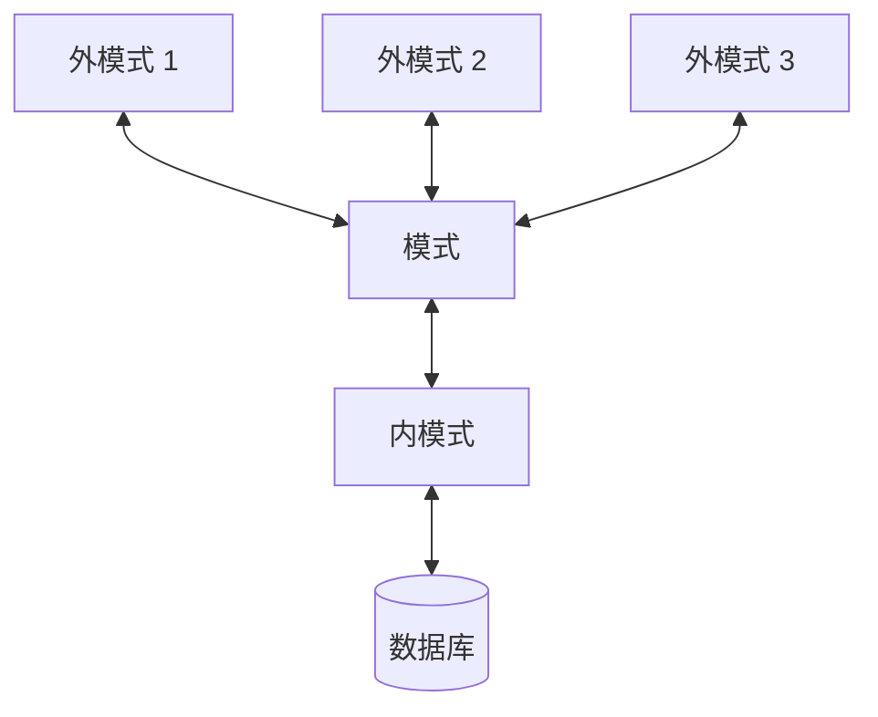

# DATABASE SYSTEM

[toc]

## 绪论

### 数据库系统概述

数据库系统特点

1. 数据结构化
2. 数据共享性高、冗余度低、易扩充
3. 数据独立性高

   - 物理独立性
     : 用户的应用程序与数据库中数据的物理存储相互独立
   - 逻辑独立性
     : 用户的应用程序与数据库的逻辑结构相互独立

4. 数据由数据库管理系统统一管理和控制

#### 数据库管理系统（DataBase Management System, DBMS）

- 数据定义语言（Data Definition Language, DDL）
- 数据操纵语言（Data Manipulation Language, DML）

### 数据模型

- 概念模型（信息模型）
  : 按用户的观点对数据和信息建模，用于数据库设计
- 逻辑模型
  : 按计算机的观点对数据建模，用于 DBMS 的实现。包括层次模型、网状模型、关系模型、面向对象数据模型、对象关系数据模型、半结构化数据模型等
- 物理模型
  : 对数据最底层的抽象，描述数据在系统内部的表示方式和存取方法，面向计算机系统

#### 数据模型的组成要素

1. 数据结构
   : 描述数据库的组成对象以及对象之间的联系
2. 数据操作
   : 对数据库中各种对象（型）的实例（值）允许执行的操作集合，包括操作及有关的操作规则
3. 数据的完整性约束条件
   : 一组完整性规则，给定的数据模型中数据及其联系所具有的制约和依存规则

#### 层次模型（Hierarchical Model）

每个结点表示一个记录类型，可包含若干字段  
有且只有一个结点没有双亲结点，称为根结点  
根以外的其他结点有且只有一个双亲结点

- 插入：不能插入没有相应双亲结点值的子女结点值
- 删除：删除双亲结点值，相应的子女结点值同时被删除

:+1:

1. 数据结构简单清晰
2. 查询效率高
3. 提供了良好的完整性支持

:-1:

1. 不适合表示多对多联系
2. 要表示一个结点具有多个双亲结点，只能引入冗余数据或创建非自然的数据结构
3. 查询子女结点必须通过双亲结点
4. 层次命令趋于程序化

#### 网状模型（Network Model）

允许一个以上结点无双亲  
一个结点可以有多于一个双亲

- 子女结点与双亲结点的联系可以不唯一，因此需要为每个联系命名，并指明与该联系有关的双亲记录和子女记录
- 支持记录码，即**唯一标识**记录的数据项的集合
- 一个联系中双亲记录和子女记录之间是一对多的联系
- 可以支持双亲记录和子女记录之间的某些约束条件

:+1:

1. 更为直接地描述现实世界
2. 具有良好的性能，存取效率较高

:-1:

1. 结构较复杂，随着应用环境的扩大变得更为复杂
2. DDL、DML 复杂，需要嵌入一种高级语言中
3. 访问数据时必须选择适当的存取路径，因此用户必须了解系统结构的细节

#### 关系模型（Relational Model）

- 关系（relation）
  : 对应一张表
- 元组（tuple）
  : 表中的一行
- 属性（attribute）
  : 表中的一列，每个属性有一个属性名
- 码（key）
  : 又称码键，表中的某个属性组，可唯一确定一个元组
- 域（domain）
  : 一组具有相同数据类型的值的集合，表示某一属性的取值范围
- 分量
  : 元组中的一个属性值
- 关系模式
  : 对关系的描述，一般表示为：$\text{关系名 }(\text{属性 }1,\text{属性 }2,\cdots\text{属性 }n)$

关系的每一个分量必须是不可分的数据项（不允许表中还有表）

:+1:

1. 建立在严格数学概念的基础上
2. 概念单一，数据结构简单清晰，易懂易用
3. 存取路径对用户透明，具有更高的数据独立性、更好的安全保密性，简化了开发建立的工作

### 数据库系统的结构

#### 三级模式结构

数据库系统由外模式、模式、内模式三级构成

##### 模式（schema）

又称逻辑模式，数据库中**全体数据**的逻辑结构和特征描述，所有用户的公共数据视图

- 中间层，不涉及数据的物理存储细节和硬件环节，与具体应用程序无关
- 一个数据库只有一个模式
- 定义模式时需要定义数据的逻辑结构，还要定义数据之间的联系
- DBMS 提供模式 DDL 来严格定义模式

##### 外模式（external schema）

又称子模式（subschema）/用户模式，数据库用户能看见和使用的**局部数据**的逻辑结构和特征描述，数据库用户的数据视图

- 通常是模式的子集
- 一个数据库可以有多个外模式，外模式描述可以不同
- 一个外模式可为多个应用系统使用，一个应用程序只能使用一个外模式
- 每个用户只能看见和访问对应外模式中的数据
- DBMS 提供外模式 DDL 来严格定义外模式

##### 内模式（internal schema）

又称存储模式（storage schema），数据物理结构和存储方式的描述

- 一个数据库只有一个内模式

#### 二级映像功能与数据独立性

三级模式之间提供两层映像：外模式 / 模式映像，模式 / 内模式映像  
保证了数据库系统中的数据具有较高的逻辑独立性和物理独立性

##### 外模式 / 模式映像

每一个外模式都有一个外模式 / 模式映像，定义该外模式与模式之间的对应关系  
模式改变时，对各个外模式 / 模式映像作相应改变，使外模式保持不变，因此也不用修改应用程序

- 通常包含在各个外模式的描述中
- 保证数据的逻辑独立性

##### 模式 / 内模式映像

数据库有唯一的模式 / 内模式映像，定义全局逻辑结构与存储结构之间的对应关系  
存储结构改变时，对模式 / 内模式映像作相应改变，使模式保持不变

- 通常包含在模式的描述中
- 保证数据的物理独立性

## 关系数据库

### 关系数据结构及形式化定义

#### 关系

域（domain）
: 一组具有相同数据类型的值的集合

一个域允许的不同取值个数称为这个域的**基数**（cardinal number）

笛卡尔积（cartesian product）
: 给定一组域 $D_1,D_2,\cdots,D_n$（允许相同），$D_1,D_2\cdots D_n$ 的笛卡尔积为

$$ D_1\times D_2\times\cdots\times D_n=\{(d_1,d_2,\cdots,d_n)|d_i\in D_i,i=1,2,\cdots,n\} $$

其中每一个元素称为一个 **$n$ 元组**（n-tuple），元素的每一个值称为一个**分量**（component）

设 $D_i$ 的基数为 $m_i$（$i=1,2,\cdots,n$），$D_1\times D_2\times\cdots\times D_n$ 的基数为

$$ M=\prod_{i=1}^n m_i $$

关系（relation）
: $D_1\times D_2\times\cdots\times D_n$ 的子集称为在域 $D_1,D_2,\cdots,D_n$ 上的关系，记作 $R(D_1,D_2,\cdots,D_n)$

$R$ 为关系的名字，$n$ 为关系的**目**或**度**（degree）

$n=1$ 时称为单元关系/一元关系（unary relation）  
$n=2$ 时称为二元关系（binary relation）

关系是一张二维表，一行对应一个元组，一列对应一个域  
每列起一个名字，称为**属性**（attribute）。$n$ 目关系有 $n$ 个属性

- 关系中的某一属性组唯一标识一个元组，而其子集不能，称为**候选码**
- 选定一个候选码为**主码**
- 候选码的各属性称为**主属性**，不包含在任何候选码中的属性称为**非主属性**或**非码属性**
- 关系模式的所有属性是候选码，称为**全码**

关系的类型

- 基本关系（基本表）
  : 实际存在的表，实际存储数据的逻辑表示
- 查询表
  : 查询结果对应的表
- 视图表
  : 由基本表或其他视图表导出的虚表，不对应实际存储的数据

基本关系的性质

1. 每一列中的分量数据类型相同，来自同一个域
2. 不同的列可出自同一个域，每一列为一个属性
3. 列的次序可以任意交换
4. 任意两个元组的候选码不能相同
5. 行的次序可以任意交换
6. 分量必须取原子值，每个分量是不可分的数据项

#### 关系模式

关系的描述称为**关系模式**（relation schema），形式化表示为

$$ R(U,D,\text{DOM},F) $$

- $R$：关系名
- $U$：组成该关系的属性名集合
- $D$：$U$ 中属性来自的域
- $\text{DOM}$：属性向域的映像集合
- $F$：属性间数据的依赖关系集合

### 关系操作

- 查询

  5 种基本操作，其他操作可用基本操作定义和导出

  - 选择
  - 投影
  - 并
  - 差
  - 笛卡尔积

- 插入、删除、修改

### 关系的完整性

#### 实体完整性

若属性或属性组 $A$ 是基本关系 $R$ 的主属性，则 $A$ 不能取 NULL

:memo: 属性组中的每个属性均不能为空

#### 参照完整性

$F$ 是基本关系 $R$ 的一个或一组属性，但不是 $R$ 的码。$K_s$ 是基本关系 $S$ 的主码  
$F$ 与 $K_s$ 相对应，则称 $F$ 是 $R$ 的**外码**，$R$ 为**参照关系**，$S$ 为**被参照关系**或**目标关系**

:memo: $R$ 和 $S$ 可以相同

参照完整性规则
: 若属性或属性组 $F$ 是基本关系 $R$ 的外码，与基本关系 $S$ 的主码 $K_s$ 相对应，则 $R$ 中每个元组在 $F$ 上的值必须或为 NULL（每个属性值均为 NULL），或等于 $S$ 某个元组的主码值

#### 用户定义完整性

如唯一值、非 NULL 等约束条件

### 关系代数

#### 传统的集合运算

- 并
- 差
- 交
- 笛卡尔积

#### 专门的关系运算

$R$ 为 $n$ 目关系，$S$ 为 $m$ 目关系，$t_r\in R$，$t_s\in S$，$\overgroup{t_rt_s}$ 称为元组的**连接**或**串接**，列数为 $n+m$

给定关系 $R(X,Z)$，$X,Z$ 为属性组，令 $t[X]=x$，$x$ 在 $R$ 中的象集为

$$ Z_x=\{t[Z]|t\in R,t[X]=x\} $$

- 选择（selection）

  又称限制（restriction）

  $$ \sigma_F(R)=\{t|t\in R\land F(t)=\text{true}\} $$

  $F$ 表示选择条件，基本形式为 $X\theta Y$  
  从行的角度进行的运算

- 投影（projection）

  $$ \Pi_A(R)=\{t[A]|t\in R\} $$

  $A$ 为 $R$ 中的属性（组）  
  从列的角度进行的运算

- 连接（join）

  又称 $\theta$ 连接

  $$ R\underset{A\theta B}{\Join}S=\{\overgroup{t_rt_s}|t_r\in R\land t_s\in S\land t_r[A]\theta t_s[B]\} $$

  $A$ 和 $B$ 列数相等，且可比  
  在 $R\times S$ 中选取满足条件的元组

  - 等值连接
    : $\theta$ 为 $=$，即选取 $A,B$ 属性值相等的元组

    $$ R\underset{A=B}{\Join}S=\{\overgroup{t_rt_s}|t_r\in R\land t_s\in S\land t_r[A]=t_s[B]\} $$

    :memo: 连接后 $A,B$ 均保留

  - 自然连接
    : 选取 $R,S$ 中同名的属性组进行等值连接，并去掉重复的属性列

    $$ R\Join S=\{\overgroup{t_rt_s}[U-B]|t_r\in R\land t_s\in S\land t_r[B]=t_s[B]\} $$

    $U$ 为 $R,S$ 的全体属性集合，$B$ 为相同的属性组

    :memo: 同时从行和列的角度进行的运算

    由于不存在相等值而被舍弃的元组称为**悬浮元组**  
    保留悬浮元组，并记其他属性值为 NULL，称为**外连接**  
    只保留左边关系 $R$ 中的悬浮元组，称为**左外连接**  
    只保留右边关系 $S$ 中的悬浮元组，称为**右外连接**

- 除运算（division）

  包含在 $R$ 中但不在 $S$ 中的属性，且其元组与 $S$ 的元组的所有组合都在 $R$ 中  
  给定 $R(X,Y),S(Y,Z)$，$X,Y,Z$ 为属性组，$R.Y$ 和 $S.Y$ 出自相同的域集

  $$ R\div S=\{t_r[X]|t_r\in R\land\Pi_Y(S)\subseteq Y_x\} $$

  同时从行和列的角度进行的运算

### 关系演算

## 关系数据库标准语言 SQL

外模式包括若干视图（view）和部分基本表（base table）  
数据库模式包括若干基本表  
内模式包括若干存储文件（stored file）

一个关系对应一个基本表  
一个或多个基本表对应一个存储文件  
一个表可有若干索引，存放在存储文件中  
视图由一个或几个基本表导出

### 索引的建立和删除

索引类型

- 顺序文件上的索引：针对按指定属性值升序或降序存储的关系，索引文件包含属性值和相应元组指针
- B+树索引：B+树的叶结点为属性值和相应元组指针
- 散列（hash）索引：将索引属性值按照散列函数值映射到相应桶中，桶中存放索引属性值和相应元组指针
- 位图索引：用位向量记录索引属性中可能出现的值，每个位向量对应一个可能值

:memo: 索引需要占用一定空间，且基本表更新时需要维护索引

## 数据库安全性

### 数据库安全性控制

#### 用户身份鉴别

- 静态口令鉴别
- 动态口令鉴别
- 生物特征鉴别
- 智能卡鉴别

#### 存取控制

1. 定义用户权限，登记在数据字典中
2. 合法权限检查

- 自主存取控制（Discretionary Access Control, DAC）
  : 用户对不同的数据库对象有不同的存取权限，不同用户对同一对象也有不同权限。用户可将拥有的存取权限转授给其他用户
- 强制存取控制（Mandatory Access Control, MAC）
  : 每个数据库对象标以一定密级，每个用户被授予某个级别的许可证。只有具有合法许可证的用户才能存取相应对象

#### 自主存取控制

`WITH GRANT OPTION` 子句允许获得权限的用户将该权限再授予其他用户
不允许循环授权

对数据的操作权限：`GRANT`、`REVOKE`

创建数据库模式一类的数据库对象的授权：由管理员在创建用户时实现

|    权限    | `CREATE USER` | `CREATE SCHEMA` | `CREATE TABLE` | 登陆数据库，查询和操纵数据 |
| :--------: | :-----------: | :-------------: | :------------: | :------------------------: |
|   `DBA`    |      :o:      |       :o:       |      :o:       |            :o:             |
| `RESOURCE` |      :x:      |       :x:       |      :o:       |            :o:             |
| `CONNECT`  |      :x:      |       :x:       |      :x:       |            :o:             |

数据库角色：权限的集合。可创建角色，为角色授权，再将角色授予用户

#### 强制存取控制

- 主体：活动实体，包括实际用户和用户的各进程
- 客体：被动实体，受实体操纵的文件、基本表、索引、视图等

DBMS 为主体和客体的每个实例纸指派一个敏感度标记（label），主体的敏感度标记称为许可证级别，客体的敏感度标记称为密级  
敏感度标记分为若干级别，如绝密（TS）、机密（S）、可信（C）、公开（P），定义次序 $\text{TS}\geq\text{S}\geq\text{C}\geq\text{P}$

存取规则

1. 主体许可证级别 $\geq$ 客体密级，主体可以读客体
2. 主体许可证级别 $\leq$ 客体密级，主体可以写客体

:memo: 用户可以为数据赋予高于自身许可证级别的密级，但不能任意降低密级。规则 2 使得客体的密级不会由高向低

### 审计

把用户对数据库的所有操作自动记录下来，放入审计日志中  
审计员利用日志监控数据库中的各种行为

## 数据库完整性

### 实体完整性实现

[概念](#实体完整性)

在 `CREATE TABLE` 中用 `PRIMARY KEY` 定义主码

在主码上自动建立一个索引  
插入记录或更新主码时通过索引查找表中是否已存在该主码值

检查和违约处理

1. 检查主码值是否唯一，不唯一则拒绝插入/修改
2. 检查主码的各个属性是否为 NULL，只要有一个为 NULL 则拒绝插入/修改

### 参照完整性实现

[概念](#参照完整性)

在 `CREATE TABLE` 中用 `FOREIGN KEY` 定义外码，用 `REFERENCES` 指明被参照表及对应主码

当下列操作破坏参照完整性时，采取相应违约处理

- 参照表插入元组/修改外码值：拒绝执行
- 被参照表删除元组/修改主码值：拒绝执行/级联删除对应元组/对应属性设置为 NULL

:memo: 拒绝执行（`NO ACTION`）一般为默认策略  
:memo: 若外码同时为参照表的主属性，则不能设置为 NULL。因此还应定义外码是否允许为 NULL

### 用户定义完整性实现

[概念](#用户定义完整性)

- 列值非空（`NOT NULL`）
- 列值唯一（`UNIQUE`）
- 列值是否满足一个表达式（`CHECK`）

检查和违约处理：不满足约束条件时拒绝执行

## 关系数据理论

[关系模式定义](#关系模式)

此处仅考虑 $R\langle U,F\rangle$

### 规范化

#### 函数依赖

设关系模式 $R$ 的属性集为 $U$，$X,Y\subseteq U$  
$R$ 的任意关系 $r$，不可能存在两个元组在 $X$ 上属性值相等，而在 $Y$ 上属性值不等，称 $X$ **函数确定** $Y$ 或 $Y$ **函数依赖于** $X$，记作 $X\to Y$  
$X$ 称为这个函数依赖的**决定属性组**（**决定因素**）

非平凡的函数依赖：$X\to Y$ 且 $Y\nsubseteq X$

完全函数依赖
: $X\to Y$，且 $\forall X'\subset X$，有 $X'\nrightarrow Y$，记作 $X\xrightarrow{F}Y$

部分函数依赖
: $X\to Y$，且不完全函数依赖，记作 $X\xrightarrow{P}Y$

传递函数依赖
: $X\to Y$，$Y\nsubseteq X$，$Y\nrightarrow X$，$Y\to Z$，$Z\nsubseteq Y$，记作 $X\xrightarrow{\text{传递}}Z$

#### 范式

$5\text{NF}\subset4\text{NF}\subset\text{BCNF}\subset3\text{NF}\subset2\text{NF}\subset1\text{NF}$

规范化
: 一个低一级范式的关系模式通过模式分解转换为若干个高一级范式的关系模式的集合

#### 1NF

满足关系的基本要求，分量不可再分

#### 2NF

满足 1NF，且每一个非主属性完全函数依赖于任何一个候选码

不满足 2NF 可能产生的问题

- 插入异常
- 删除异常
- 修改复杂

规范化方法：使用投影分解，将对码不完全函数依赖的非主属性和对应的主属性分解出单独的表

#### 3NF

满足 1NF，且每一个非主属性不传递依赖于码  
满足 3NF 则必满足 2NF

规范化方法：将存在传递依赖的表分解

#### BCNF (Boyce Codd Normal Form)

满足 1NF，且每个函数依赖的决定因素都含有码。又称修正/扩充的第三范式  
满足 BCNF 则必满足 3NF

#### 多值依赖

设关系模式 $R$ 的属性集为 $U$，$X,Y,Z\subseteq U$，其中 $Z=U\setminus X\setminus Y$  
$R$ 的任意关系 $r$，给定一对 $(x,z)$，可得一组 $Y$ 的值，且仅取决于 $x$ 的值，与 $z$ 的值无关，称 $Y$ **多值依赖于** $X$，记作 $X\to\to Y$

平凡的多值依赖：$X\to\to Y$，且 $Z=\varnothing$

多值依赖的性质

- 对称性：若 $X\to\to Y$，则 $X\to\to Z$
- 传递性：若 $X\to\to Y$，$Y\to\to Z$，则 $X\to\to Z\setminus Y$
- 函数依赖是多值依赖的特殊情况

#### 4NF

满足 1NF，且对于每个非平凡多值依赖，$X$ 都含有码  
满足 4NF 则必满足 BCNF

### 数据依赖的公理系统

设关系模式 $R\langle U,F\rangle$，对其中任意一个关系 $r$，都有 $X\to Y$ 成立，称 $F$ **逻辑蕴含** $X\to Y$

Armstrong 公理系统（Armstrong's Axiom）

- 自反律：若 $Y\subseteq X\subseteq U$，则 $F$ 蕴含 $X\to Y$
- 增广律：若 $F$ 蕴含 $X\to Y$，且 $Z\subseteq U$，则 $F$ 蕴含 $X\cup Z\to Y\cup Z$
- 传递率：若 $F$ 蕴含 $X\to Y$ 和 $Y\to Z$，则 $F$ 蕴含 $X\to Z$

推论

- 合并规则：若 $X\to Y$，$X\to Z$，则 $X\to Y\cup Z$
- 伪传递规则：若 $X\to Y$，$W\cup Y\to Z$，则 $X\cup W\to Z$
- 分解规则：若 $X\to Y$，$Z\subseteq Y$，则 $X\to Z$

$X\to\bigcup_{i=1}^kA_i\iff X\to A_i\ (i=1,2,\cdots,k)$

$F$ 的闭包
: $R\langle U,F\rangle$ 中 $F$ 蕴含的函数依赖的全体，记作 $F^+$

### 模式的分解

## 数据库设计

### E-R 模型

### 存取方法选择

常用的方法为索引方法和聚簇方法

#### B+树索引存取方法的选择

- 一个或一组属性经常在查询条件中出现
- 一个属性经常作为聚集函数的参数
- 一个或一组属性经常出现在连接操作的连接条件中

维护索引需要成本，因此不宜在更新频率很高的关系上建立太多索引

#### Hash 索引存取方法的选择

- 一个关系的大小可预知，且不变
- 关系的大小动态改变，但 DBMS 提供了动态 Hash 存取方法

#### 聚簇存取方法的选择

把某个属性或属性组上具有相同值的元组集中存放在连续的物理块中，形成聚簇  
该属性或属性组称为**聚簇码**

也适用于经常进行连接操作的多个关系，将多个连接关系的元组按连接属性值聚集存放

一个数据库可以建立多个聚簇，一个关系只能加入一个聚簇

- 经常在一起进行连接操作的关系
- 一个关系的一组属性经常出现在相等比较条件中
- 一个关系的一个或一组属性上的值重复率很高

聚簇中不必要的关系

- 经常进行全表扫描的关系
- 更新操作远多于连接操作的关系
- 一个关系不能同时加入多个聚簇

## 数据库编程

## 关系查询处理和查询优化

### 查询处理步骤

1. 查询分析：扫描、词法分析、语法分析
2. 查询检查：语义检查、视图消解，检查通过后将 SQL 转化成内部表示（关系代数表达式）
3. 查询优化：分为代数优化和物理优化
4. 查询执行：由代码生成器生成执行查询计划的代码

### 查询操作的实现

#### 选择操作

- 全表扫描算法（Table scan）
- 索引扫描算法（Index scan）

#### 连接操作

- 嵌套循环算法（Nested loop join）

  对表 A 的每一个元组，循环检查表 B 的每一个元组

- 排序-合并算法（Sort-merge join）：等值连接常用算法

  1. 对要连接的表按目标属性排序
  2. 对表 A 的每一个元组，检查表 B 的每一个元组，目标属性值相同则连接
  3. 当扫描到第一个不相同的元组时，选取表 A 的下一个元组，重复上述步骤

- 索引连接算法（Index join）

  1. 在表 A 上建立目标属性的索引
  2. 对表 B 的每个元组，通过索引在表 A 上查找相应的元组，并连接
  3. 重复上述步骤

- Hash join 算法：处理等值连接

  1. 对表 A 创建 Hash 表
  2. 对表 B 按相同的 Hash 函数创建 Hash 表
  3. 将 Hash 值相同的元组相连接

## 数据库恢复技术

### 事务

用户定义的一个数据库操作序列，一个不可分割的工作单位（必须全做或全不做）

事务以 `BEGIN TRANSACTION` 开始，以 `COMMIT` 或 `ROLLBACK` 结束

ACID 特性

1. 原子性（Atomicity）
2. 一致性（Consistency）
3. 隔离性（Isolation）
4. 持续性（Durability）

### 故障的种类

- 事务内部的故障

  事务没有到达预期的终点，因此需要强行回滚，即**事务撤销**（UNDO）

- 系统故障（软故障）

  回滚所有非正常终止/未完成的事务  
  **重做**（REDO）所有已提交的事务

- 介质故障（硬故障）

  外存故障，将破坏所有或部分数据库，破坏性最大

- 计算机病毒

### 恢复的实现技术

#### 数据转储

定期将整个数据库复制到磁盘、磁带等存储介质上保存，称为**后备副本**  
重装后备副本将数据库恢复到转储时的状态

- 静态转储
  : 系统中无运行事务时进行转储，转储期间不允许对数据库的存取、修改
- 动态转储
  : 转储期间允许对数据库进行存取和修改。需要建立**日志文件**，记录转储期间的各修改活动。后备副本加上日志文件可得到正确状态
- 海量转储
  : 每次转储全部数据库
- 增量转储
  : 每次只转储上一次转储后更新的数据

#### 登记日志文件

日志文件用于记录事务对数据库的更新操作

需要登记的内容：

- 各个事务的开始标记
- 各个事务的结束标记
- 各个事务的所有更新操作

每个日志记录的内容：

- 事务标识
- 操作的类型
- 操作对象
- 更新前数据的旧值
- 更新后数据的新值

##### 日志文件的作用

1. 事务故障恢复和系统故障恢复必须使用日志文件
2. 动态转储方式中必须建立日志文件
3. 静态转储方式中也可建立日志文件，后备副本重装后利用日志文件进行重做和撤销

##### 登记日志文件的原则

1. 登记次序严格按照并发事务执行的时间次序
2. 先写日志文件，后写数据库

### 恢复策略

#### 事务故障的恢复

1. 反向扫描日志文件，查找事务的更新操作
2. 对事务的更新操作执行逆操作，将更新前的数据旧值写入数据库
3. 重复上述操作直至事务的开始标记处，恢复完成

#### 系统故障的恢复

1. 正向扫描日志文件，找到故障发生前已经提交的事务，记入重做队列（REDO-LIST）；找到故障发生时尚未完成的事务，记入撤销队列（UNDO-LIST）
2. 对撤销队列中的各个事务进行撤销处理。反向扫描日志文件，对事务的更新操作执行逆操作
3. 对重做队列中的各个事务进行重做处理。正向扫描日志文件，对事务重新执行日志文件登记的操作

#### 介质故障的恢复

1. 装入最新的数据库后备副本。对于动态转储，还应装入转储开始时刻的日志文件副本，利用 REDO 和 UNDO 恢复数据库
2. 装入转储结束时刻的日志文件副本，重做已完成的事务

### 具有检查点的恢复技术

在日志文件中增加**检查点记录**，增加一个重新开始文件

检查点记录的内容

1. 建立检查点时刻所有正在执行的事务
2. 上述事务最近一个日志记录的地址

重新开始文件用于记录各个检查点记录在日志文件中的地址

动态维护日志文件，周期性建立检查点，保存数据库状态

1. 日志缓冲区中的所有日志记录写入日志文件
2. 在日志文件中写入一个检查点记录
3. 数据缓冲区的所有数据记录写入数据库
4. 将检查点在日志文件中的地址写入重新开始文件

- 事务在检查点前提交，说明事务所做的更新已写入数据库，恢复时无需重做
- 事务在检查点后、故障点前提交：重做
- 事务在故障点时还未完成：撤销

#### 利用检查点进行恢复

1. 从重新开始文件中找到最后一个检查点记录的地址，在日志文件中找到该记录
2. 检查点建立时刻正在执行的事务记入 UNDO-LIST
3. 从检查点开始正向扫描日志文件，若有新开始的事务，记入 UNDO-LIST；若有提交的事务，将其从 UNDO-LIST 移入 REDO-LIST
4. 执行 UNDO 和 REDO 操作

### 数据库镜像

DBMS 自动把整个数据库或其中的关键数据复制到另一个磁盘上  
主数据库更新时自动复制更新后的数据

## 并发控制

### 封锁

- 排他锁（写锁，X 锁）
  : 允许加锁事务读取和修改，其他事务不能再加任何锁
- 共享锁（读锁，S 锁）
  : 允许加锁事务读取，其他事务可以再加 S 锁

### 封锁协议

- 一级封锁协议
  : 事务进行修改前必须加 X 锁，事务结束后释放

  可防止丢失修改，使事务可恢复  
  读取无需加锁，不能保证可重复读和避免脏数据

- 二级封锁协议
  : 在一级的基础上，事务进行读取前必须加 S 锁，读完后释放

  进一步防止读脏数据  
  读完就释放，不能保证可重复读

- 三级封锁协议
  : 在一级的基础上，事务进行读取前必须加 S 锁，事务结束后释放

  进一步防止不可重复读

### 活锁和死锁

#### 活锁

采用现在先服务策略避免活锁

#### 死锁

##### 死锁的预防

- 一次封锁法：事务必须一次将所有要使用的数据全部加锁
- 顺序封锁法：对数据对象规定一个封锁顺序，事务按这个顺序实施封锁

##### 死锁的诊断与解除

- 超时法：事务的等待时间超过规定时限，认为发生了死锁
- 等待图法：有向图，结点表示事务，有向边表示正在等待的事务。若图中存在回路，表明出现了死锁

### 并发调度的可串行性

多个事务的并发执行是正确的 $\iff$ 其结果与某一串行执行的结果相同  
称为**可串行化调度**

#### 冲突可串行化调度

冲突操作：不同事务对同一数据的读写/写写操作

不同事务的冲突操作和同一事务的两个操作不能交换

一个调度通过交换非冲突操作的次序，得到一个串行的调度，称为**冲突可串行化的调度**  
若一个调度冲突可串行化，则它是可串行化调度（充分条件）

### 两段锁协议（Two Phase Locking, 2PL）

1. 扩展阶段：事务在读写操作前对数据进行封锁
2. 收缩阶段：释放一个锁之后，事务不再申请和获得其他封锁

若并发执行的所有事务均遵守两段锁协议，则任意调度都是可串行化的（充分条件）

### 封锁的粒度

封锁粒度（Granularity）
: 封锁对象的大小，包括逻辑单元（属性值、元组、关系、索引项、整个数据库等）和物理单元（页、物理记录等）

封锁粒度越大，并发度越小，开销越小  
封锁粒度越小，并发度越高，开销越大

#### 多粒度封锁（Multiple Granularity Locking）

一个系统中同时支持多种粒度供不同的事务选择

多粒度树：根结点为整个数据库，叶结点为最小的数据粒度

多粒度封锁协议

多粒度树中每一个结点可以被独立加锁  
一个结点被加锁，则它的所有子孙结点被加上同类型的锁

- 显式封锁
  : 事务直接给数据对象加锁
- 隐式封锁
  : 因为祖先结点被加锁而使数据对象上锁

检查封锁冲突时，除检查显式封锁外，还要检查目标结点的祖先结点、子孙结点  
效率很低

#### 意向锁

意向锁代表该结点的子孙结点被加锁  
给任意结点加锁时，须 ***先*** 对祖先结点加意向锁

- 意向共享锁（Intent Share Lock, IS）
  : 表明子孙结点拟加 S 锁
- 意向排他锁（Intent Exclusive Lock, IX）
  : 表明子孙结点拟加 X 锁
- 共享意向排他锁（Share Intent Exclusive Lock, SIX）
  : 表明该结点加了 S 锁和 IX 锁

申请封锁时自上而下，释放封锁时自下而上  
检查封锁冲突时只需向上搜索
