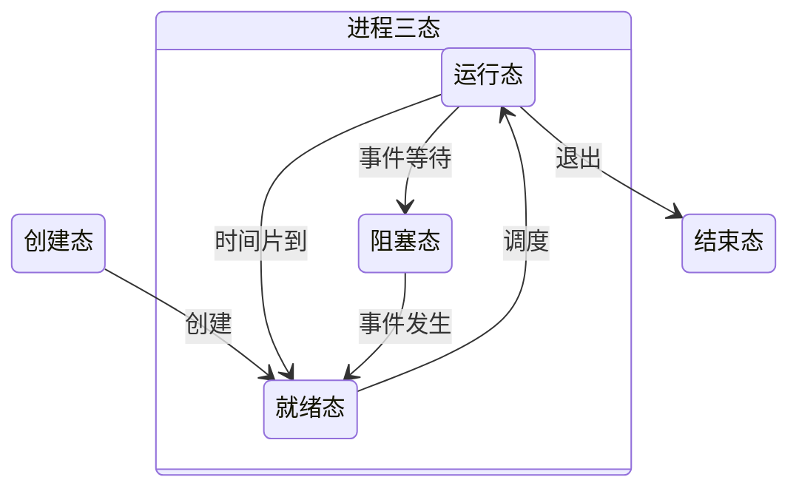

# OPERATING SYSTEM

[toc]

## 操作系统概述

### 操作系统的特征

1. 并发（Concurrence）
   : 两个或多个事件在同一时间间隔内发生。系统中同时存在多个运行的程序，能够处理和调度多个程序同时执行

   :memo: 并发（同一时间间隔）；并行（同一时刻）

2. 共享（Sharing）
   : 系统中的资源可供多个并发执行的进程共同使用

   1. 互斥共享方式：一段时间内只允许一个进程访问该资源。临界资源。如大多数物理设备以及软件中的栈、变量、表格
   2. 同时访问方式：进程交替对资源进行分时共享。如磁盘

3. 虚拟（Virtual）
   : 把一个物理上的实体变为若干逻辑上的对应物

   1. 时分复用技术：如虚拟处理器
   2. 空分复用技术：如虚拟存储器

4. 异步（Asynchronism）
   : 并发执行的多个程序异步执行。OS 保证异步执行的进程不出错

资源共享以程序并发为条件，并发受共享管理的影响

### 操作系统的目标和功能

#### 管理计算机系统资源

1. 处理机管理
2. 存储器管理
3. 文件管理
4. 设备管理

#### 提供用户与计算机硬件系统之间的接口

1. 命令接口

   1. 联机命令接口：交互式命令接口
   2. 脱机命令接口：批处理命令接口

2. 程序接口：最为流行的是图形用户界面（GUI），即图形接口

#### 扩充计算机资源

裸机
: 没有任何软件支撑的计算机

扩充机器（虚拟机）
: 覆盖了软件的机器

### 操作系统发展与类型

#### 手工操作阶段

计算机上所有工作都要人工干预

:-1: 用户独占全机，资源利用率低；CPU 等待手工操作，CPU 利用不充分

#### 单道批处理系统

系统对作业的处理成批进行，内存中始终保持一道作业

1. 自动性
   : 作业自动逐个运行，无须人工干预
2. 顺序性
   : 作业顺序进入内存，先调入先完成
3. 单道性
   : 内存中仅有一道程序运行。当前程序完成或发生异常时才换入后继程序

#### 多道批处理系统

允许多个程序同时进入内存并在 CPU 中交替运行，共享系统中的各种硬/软件资源  
切换任务花费的时间很少，实现系统各部件之间并行工作  
设计和实现比单道批处理复杂

1. 多道
   : 内存中同时存放多道互相独立的程序
2. 宏观上并行
   : 同时进入系统的多道程序都处于运行过程中
3. 微观上串行
   : 多道程序轮流占有 CPU，交替执行

需要解决的问题

1. 如何分配处理器
2. 多道程序的内存分配
3. I/O 设备如何分配
4. 如何组织和存放大量的程序和数据，方便用户使用，且保证其安全性和一致性

:+1: 资源利用率高，系统吞吐量大，CPU 和其他资源保持忙碌状态  
:-1: 用户响应时间较长，不提供人机交互能力，用户无法了解程序运行状况，无法控制计算机

#### 分时操作系统

多个用户通过终端同时共享一台主机，同时交互，互不干扰  
处理器的运行时间分成很短的时间片，轮流分配给各联机作业  
若在时间片内不能完成，则暂时停止运行，继续时间片轮转

- 支持多道程序设计
- 实现人机交互

1. 同时性
   : 也称多路性。允许多个终端用户同时使用一台计算机
2. 交互性
   : 用户方便进行人机对话
3. 独立性
   : 多个用户彼此独立地进行操作
4. 及时性
   : 用户请求在很短时间内获得响应。采用时间片轮转方式

#### 实时操作系统

系统接收到外部信号后及时进行处理，在严格时限内处理完接收的事件，不需要时间片排队

- 硬实时系统
  : 某个动作必须绝对地在规定时刻（或时间范围）发生。如飞行自动控制系统
- 软实时系统
  : 能够接受偶尔违反时间规定，不会引起永久性损害。如订票系统、银行管理系统

1. 及时性
2. 可靠性

#### 网络操作系统

计算机网络中的各台计算机有机结合，提供统一有效的使用方法，实现计算机之间数据的相互传送  
网络中各资源共享，各台计算机相互通信

#### 分布式计算机系统

任意两台计算机通过通信方式交换信息  
每台计算机具有同等的地位  
每台计算机的资源为所有用户共享  
任意台计算机都可构成一个子系统，可重构  
工作可分布在几台计算机上，并行工作、协同完成

1. 分布性
2. 并行性

:memo: 与网络 OS 的本质不同：分布式 OS 中的计算机相互协同完成同一任务

#### 个人计算机操作系统

目前使用最广泛的 OS，用于文字处理、电子表格、游戏等

### 操作系统运行环境

#### 处理器运行模式

CPU 执行系统内核程序和用户自编程序  
内核程序可以执行特权指令，用户自编程序不能执行

1. 特权指令
   : 不允许用户直接使用的指令

   如 I/O 指令、置中断指令、存取用于内存保护的寄存器、送程序状态字到 PSW 等

2. 非特权指令
   : 允许用户直接使用的指令

   不能直接访问系统中的软硬件资源，只能访问用户的地址空间  
   防止用户程序对系统造成破坏

CPU 运行模式划分为**用户态**（目态）和**核心态**（管态/内核态）

- 用户自编程序运行在用户态，只能执行非特权指令
- 内核程序运行在核心态，可以执行特权指令

:memo: 核心态切换到用户态的指令也是特权指令，一般是中断返回指令

#### 操作系统内核

与硬件关联紧密的模块、运行频率较高的程序构成了 OS 内核，指令操作工作在核心态

1. 时钟管理

   - 时钟管理提供系统时间
   - 时钟中断管理实现进程切换

2. 中断机制

   - I/O 输入、进程管理和调度、系统功能的调用、文件访问
   - 中断机制中只有一小部分功能属于内核，负责保护和恢复中断现场的信息，转移控制权到相关处理程序。减少中断的处理时间，提高系统的并行处理能力

3. 原语（Atomic Operation）

   一些可被调用的公用小程序，各自完成一个规定的操作

   - 处于 OS 最底层，最接近硬件
   - 运行具有原子性，不可中断（出于安全性和便于管理）
   - 运行时间较短，调用频繁

   设备驱动、CPU 切换、进程通信等中的部分操作都可定义为原语

4. 系统控制的数据结构及处理

   - 进程管理：进程状态管理、进程调度和分派、创建和撤销 PCB
   - 存储器管理：存储器的空间分配和回收、内存信息保护程序、代码对换程序
   - 设备管理：缓冲区管理、设备分配和回收

#### 中断和异常

中断或异常是上层程序从用户态进入核心态唯一的途径  
发生中断或异常时，用户态 CPU 立即进入核心态，通过硬件实现（如用一个特殊寄存器位表示 CPU 的工作状态）

见[组成原理-异常和中断机制](./ComputerOrganization.md#异常和中断机制)

- 中断：I/O 结束中断，时钟中断（时间片到）
- 异常：非法操作码、地址越界、运算溢出、缺页、陷入指令

#### 系统调用

OS 提供的一些子功能，可视为特殊的公共子程序  
用户程序中与资源有关的操作都必须通过系统调用

- 设备管理：设备的请求或释放，设备启动等
- 文件管理：文件的读、写、创建、删除
- 进程控制：进程的创建、撤销、阻塞、唤醒
- 进程通信：进程之间的消息传递或信号传递
- 内存管理：内存的分配、回收，获取作业占用内存区大小及始址

系统调用由内核程序负责，运行在**核心态**  
用户程序可以执行陷入（访管）指令发起系统调用

:memo: 由用户态进入核心态，状态需要切换，所用的堆栈也由用户堆栈切换至系统堆栈。系统堆栈同样属于该进程

### 操作系统结构

#### 分层法

将 OS 分为若干层，最底层 0 为硬件，最高层 N 为用户接口  
每层只能调用低一层的功能和服务

:+1: 便于系统的调试和验证，简化系统的设计和实现（逐层向上调试）；易扩充易维护  
:-1: 合理定义各层较困难，依赖关系固定后不灵活；效率较差

#### 模块化

OS 按功能划分为若干具有一定独立性的模块  
每个模块具有某方面的管理功能，模块间有接口用于通信  
模块可以划分为子模块，子模块间有接口  
称为**模块-接口法**

划分模块时需要考虑模块独立性

- 内聚性
  : 模块内各部分联系的紧密程度。高内聚，独立性越好
- 耦合度
  : 模块间相互联系和影响的程度。低耦合，独立性越好

:+1: 提高 OS 设计的正确性、可理解性、可维护性；增强 OS 的可适应性；加速 OS 的开发过程  
:-1: 接口规定很难满足实际需求；无法找到可靠的模块决定顺序

#### 宏内核

也称单内核或大内核，将系统的主要功能模块作为一个紧密联系的整体运行在核心态  
具有性能优势

#### 微内核

将最基本功能保留在内核，非核心功能转移至用户态  
降低设计的复杂性，方便扩展系统  
内核外被划分为若干服务程序，执行相互独立，通过微内核交互通信

微内核包含

1. 与硬件处理紧密相关的部分
2. 一些较基本的功能
3. 客户与服务器之间的通信

微内核的基本功能

1. 进程（线程）管理：通信、切换、调度，多处理机同步；调度策略在微内核外
2. 低级存储器管理：页表机制、地址变换机制；管理策略、置换算法、内存分配回收策略在微内核外
3. 中断和陷入处理：捕获中断和陷入，进行中断响应处理

微内核的特点

1. 扩展性和灵活性
2. 可靠性和安全性
3. 可移植性
4. 分布式计算

:+1: 扩展性、灵活性，可靠性、安全性，可移植性，可很好地支持分布式计算  
:-1: 频繁在核心态和用户态之间切换，性能开销大

#### 外核（Exokernel）

外核在内核态中运行，为虚拟机分配资源  
检查资源的企图，确保没有机器使用他人的资源  
每个用户的虚拟机限制在已申请且获得分配的资源  
保持多个虚拟机彼此不发生冲突

:+1: 减少了映射层，无需重映射磁盘地址；将多道程序（外核内）和用户 OS 代码（用户空间内）分离

### 操作系统引导

利用 CPU 运行特定程序，识别硬盘和分区，识别分区上的 OS，启动 OS

1. 激活 CPU

   CPU 读取 ROM 中的 boot 程序，指令寄存器置为 BIOS 的第一条指令，开始执行 BIOS 的指令

2. 硬件自检

   检查硬件是否故障。如有故障，发出蜂鸣警报

3. 加载带有 OS 的硬盘

   BIOS 读取 Boot Sequence，控制权交给启动顺序第一位的存储设备，CPU 将其引导扇区的内容加载到内存

4. 加载主引导记录 MBR

   如果一个存储设备不是可引导盘，则检查下一个设备。MBR 告诉 CPU 去硬盘的哪个主分区找 OS

5. 扫描硬盘分区表，加载硬盘活动分区

   MBR 包含硬盘分区表，以特定标识符区分活动分区和非活动分区。扫描分区表找到含有 OS 的分区（活动分区），加载活动分区，控制权交给活动分区

6. 加载分区引导记录 PBR

   读取活动分区的第一个扇区（PBR），寻找并激活根目录下的启动管理器

7. 加载启动管理器

   启动管理器用于引导 OS

8. 加载 OS

### 虚拟机

逻辑计算机，利用虚拟化技术隐藏特定计算平台的实际物理特性，提供抽象、统一、模拟的计算环境

#### 第一类虚拟机管理程序

运行在最高特权级，在裸机上运行，具备多道程序功能  
向上提供若干台虚拟机

虚拟机上的 OS 运行在虚拟内核态（实际为用户态）  
虚拟机运行特权指令时会陷入虚拟机管理程序

#### 第二类虚拟机管理程序

依赖于**宿主操作系统**（Windows、Linux 等）分配和调度资源的程序，类似普通的进程  
仍伪装成具有 CPU 和各种设备的完整计算机

:memo: 运行在两类虚拟机管理程序上的 OS 都称为**客户操作系统**

虚拟化常应用于 Web 主机（云主机）

## 进程与线程

### 进程的概念

**进程控制块**（Process Control Block, PCB）描述进程的基本情况和运行状态，控制和管理进程  
程序段、相关数据段、PCB 三部分构成**进程实体**（进程映像）。见[进程的组织](#进程的组织)

创建进程实质是创建 PCB，撤销进程实质是撤销 PCB

:memo: PCB 是进程存在的唯一标志

进程是进程实体的运行过程，是 OS 进行资源分配和调度的一个独立单位

### 进程的特征

1. 动态性
2. 并发行
3. 独立性
4. 异步性

### 进程的状态与转换

1. 运行态
   : 进程在处理机上运行
2. 就绪态
   : 进程获得了除处理机外的一切所需资源
3. 阻塞态（等待态）
   : 进程等待某一事件而暂停，如等待资源可用，等待 I/O 完成
4. 创建态
   : 进程正在被创建，尚未到就绪态。创建进程时需要分配所需资源，若无法满足则为创建态
5. 结束态
   : 进程正常结束或因其他原因退出运行。首先置为结束态，之后进一步资源释放回收

- 就绪态 $\to$ 运行态：获得处理机资源（时间片）
- 运行态 $\to$ 就绪态：时间片用完；可剥夺式系统中更高优先级的进程就绪，当前执行的进程转换为就绪态
- 运行态 $\to$ 阻塞态：进程请求某一资源或等待某一事件发生。进程以系统调用的形式请求操作系统提供服务
- 阻塞态 $\to$ 就绪态：进程等待的事件到来



:memo: 运行态 $\to$ 阻塞态是主动行为；阻塞态 $\to$ 就绪态是被动行为，需要其他相关进程协助

### 进程的组织

#### 进程控制块

PCB 主要包括进程描述信息、进程控制和管理信息、资源分配清单、处理机相关信息

|   进程描述信息    | 进程控制和管理信息 | 资源分配清单 | 处理机相关信息 |
| :---------------: | :----------------: | :----------: | :------------: |
| 进程标识符（PID） |    进程当前状态    |  代码段指针  |  通用寄存器值  |
| 用户标识符（UID） |     进程优先级     |  数据段指针  |  地址寄存器值  |
|                   |  代码运行入口地址  |  堆栈段指针  |  控制寄存器值  |
|                   |   程序的外存地址   |  文件描述符  |  标志寄存器值  |
|                   |    进入内存时间    |     键盘     |     状态字     |
|                   |   处理机占用时间   |     鼠标     |                |
|                   |     信号量使用     |              |                |

1. 进程描述信息

   - 进程标识符
     : 唯一的标识号
   - 用户标识符
     : 进程归属的用户

2. 进程控制和管理信息

   - 进程当前状态
     : 描述状态信息，处理机分配调度的依据
   - 进程优先级
     : 描述抢占处理机的优先级

3. 资源分配清单：有关内存地址空间或虚拟地址空间的状况、打开文件的列表、使用的 I/O 设备信息
4. 处理机相关信息：也称处理机的上下文，主要是各寄存器的值。进程切换时，处理机状态信息保存在 PCB 中，便于恢复断点

组织 PCB 的方式

1. 链接
   : 同一状态的 PCB 链接成一个队列。阻塞态可根据阻塞原因不同排成多个阻塞队列
2. 索引
   : 同一状态的 PCB 组织为一个索引表

#### 程序段

能被进程调度程序调度到 CPU 执行的程序代码段

:memo: 程序可被多个进程共享，即多个进程运行同一个程序

#### 数据段

进程对应的程序加工处理的原始数据，或程序执行时产生的中间或最终结果

### 进程控制

进程控制用的程序段称为原语

#### 进程的创建

一个进程（父进程）可以创建另一个进程（子进程）  
子进程可以继承父进程的所有资源，子进程撤销时将资源归还父进程  
父进程撤销时，同时撤销所有子进程

创建原语：

1. 为新进程分配一个唯一的 PID，申请一个空白 PCB（PCB 是有限的）。若 PCB 申请失败则创建失败
2. 为进程分配运行所需资源，如内存、文件、I/O 设备和 CPU 时间等。资源从 OS 或父进程获得。资源不足则处于创建态
3. 初始化 PCB，包括初始化标志信息、初始化处理机状态信息、初始化处理机控制信息、设置进程优先级等
4. 若就绪队列能够接纳新进程，则插入就绪队列

#### 进程的终止

引起进程终止的事件

1. 正常结束
2. 异常结束：运行时发生异常而无法继续运行
3. 外界干预：应外界请求而终止，如操作干预、父进程请求、父进程终止

终止原语：

1. 根据进程 PID 检索 PCB，读出进程的状态
2. 若处于运行态，则立即终止，将处理机分配给其他进程
3. 若进程有子进程，则终止所有子进程
4. 进程的所有资源归还给父进程或 OS
5. 将该 PCB 从所在队列（链表）中删除

#### 进程的阻塞和唤醒

阻塞原语（Block）：

1. 找到进程 PID 对应的 PCB
2. 若处于运行态，则保护现场，置为阻塞态，停止运行
3. PCB 插入相应事件的等待队列，将处理机调度给其他就绪进程

阻塞进程期待的事件出现，由有关进程将该进程唤醒

唤醒原语（Wakeup）：

1. 在该事件的等待队列中找到进程的 PCB
2. 从等待队列中移出进程，置为就绪态
3. PCB 插入就绪队列，等待调度

:memo: Block 和 Wakeup 作用刚好相反，必须成对使用

### 进程通信

[PV 操作](#信号量)是低级通信方式，高级通信方式是指以较高的效率传输大量数据的通信方式

#### 共享存储

通信的进程间存在一块可直接访问的共享空间，通过对该空间的读/写实现信息交换  
需要使用同步互斥工具（如 PV 操作）控制读/写操作

1. 低级方式：基于数据结构的共享
2. 高级方式：基于存储区的共享

OS 提供存储空间和同步互斥工具，数据交换由用户安排读/写指令完成

:memo: 进程无法直接访问其他进程的空间，共享空间通过特殊的系统调用实现

#### 消息传递

进程间的数据交换以格式化的消息（Message）为单位  
若不存在共享空间则必须通过消息传递  
通过系统提供的发送消息和接受消息两个原语进行数据交换

- 隐藏了通信实现细节，对用户透明，简化通信程序的设计
- 当前应用最广泛的进程间通信机制
- 微内核 OS 中微内核与服务器的通信采用了消息传递机制
- 多处理机系统、分布式系统、计算机网络中最主要的通信工具

1. 直接通信方式
   : 发送进程直接把消息发送给接收进程，挂在接收进程的消息缓冲队列上，接收进程从消息缓冲队列取得消息
2. 间接通信方式
   : 发送进程把消息发送给中间实体（信箱），接收进程从信箱取得消息。广泛应用于计算机网络中

#### 管道通信

管道（pipe 文件）
: 连接一个读进程和一个写进程的共享文件，实现它们之间的通信

写进程以字符流形式将数据送入管道，读进程从管道中接收数据  
管道必须提供的协调能力：互斥、同步、确定对方的存在

- 在 Linux 中使用非常频繁
- 管道是固定大小的缓冲区，被写满时会默认阻塞 `write()` 调用
- 读进程比写进程快时，管道变空，会默认阻塞 `read()` 调用

:memo: 管道中读取是一次性操作，一旦读取就释放空间。管道采用**半双工通信**，某一时刻只能单向传输，实现互动通信需要两个管道

### 线程和多线程模型

- 线程是一个基本的 CPU 执行单元
- 程序执行流的最小单元，系统独立调度和分派的基本单位
- 线程是进程中的一个实体，不拥有系统资源，可以共享进程的所有资源
- 线程可以创建和撤销另一个线程
- 同一进程的多个线程可以并发执行
- 线程运行呈现间断性

线程组成：线程 ID、程序计数器、寄存器集合、堆栈  
基本状态：就绪、阻塞、运行

#### 线程和进程的比较

进程作为除 CPU 外的系统资源的分配单元，线程作为处理机的分配单元

1. 调度：线程是独立调度的基本单位，同一进程中的线程切换不会引起进程切换。线程切换的开销远低于进程切换
2. 并发性：进程、同一进程中的线程、不同进程的线程均可并发执行，OS 具有更好的并发性，提高资源利用率和吞吐量
3. 拥有资源：进程是拥有资源的基本单位，线程不拥有资源（仅有保证独立运行的必要资源）。线程可以访问隶属进程的系统资源，属于同一进程的线程具有相同的地址空间
4. 独立性：每个进程拥有独立的地址空间和资源，线程共享进程的地址空间和资源
5. 系统开销：创建、撤销、切换线程时的开销远小于进程。同一进程内线程之间的同步与通信非常容易实现
6. 支持多处理机系统：多线程进程可以将多个线程分配到多个处理机上执行

#### 线程的属性

进程处于执行状态，实际上是指进程中的某线程正在执行

- 线程是一个轻型实体，不拥有系统资源。每个线程有一个唯一的标识符和一个线程控制块，记录线程执行的寄存器和栈等现场状态
- 不同的线程可以执行相同的程序。同一个服务程序被不同用户调用时，创建成不同的线程
- 同一进程中的各个线程共享进程拥有的资源
- 线程是处理机的独立调度单位，可并发执行。单 CPU 下交替占用 CPU，多 CPU 下同时占用不同 CPU。多个 CPU 同时为一个进程的多个线程服务，可缩短进程处理时间
- 一个线程创建后便开始生命周期，经历阻塞态、就绪态、运行态等变化

#### 线程的状态与转换

1. 运行态
   : 线程在处理机上运行
2. 就绪态
   : 线程具备除处理机外的一切条件
3. 阻塞态（等待态）
   : 线程因某事件受阻而处于暂停状态

#### 线程的组织与控制

##### 线程控制块（TCB）

1. 线程标识符
2. 一组寄存器：程序计数器、状态寄存器、通用寄存器
3. 线程运行状态：描述线程所处的状态
4. 优先级
5. 线程专有存储区：切换时用于保存现场
6. 堆栈指针：过程调用时保存局部变量及返回地址等

:memo: 同一进程中的所有线程共享地址空间，因此一个线程可以读/写另一个线程的堆栈

##### 线程的创建

初始化线程用于创建新线程  
创建新线程时需要调用线程创建函数，并提供相应参数（程序入口指针、堆栈大小、优先级等）。函数返回线程标识符

##### 线程的终止

终止线程调用相应函数执行终止操作  
线程终止后，进程中其他线程执行分离函数，被终止线程才与资源分离  
尚未释放资源的线程仍可被其他线程调用，以使其重新恢复运行

#### 线程的实现方式

##### 用户级线程（User-Level Thread, ULT）

线程管理（创建、撤销、切换）的所有工作都由应用程序在用户空间中完成，内核意识不到线程的存在  
应用程序通过调用线程库在同进程中创建新线程，实现多线程程序  
调度仍以进程为单位，导致不同进程中线程的运行时间不同

:+1:

1. 线程切换不用转换到内核空间
2. 不同进程可根据自身需要选择不同调度算法
3. 实现与 OS 平台无关，属于用户程序的一部分

:-1:

1. 执行系统调用时，一个进程内的所有线程被阻塞
2. 一个进程分配一个 CPU，无法应用多处理机的优势

##### 内核级线程（Kernel-Level Thread, KLT）

又称**内核支持的线程**  
线程管理在内核空间内实现  
内核空间为每个线程设置 TCB，据此感知线程的存在并加以控制

:+1:

1. 能发挥多处理机的优势
2. 若一个线程被阻塞，可以调度其他线程，也可运行其他进程中的线程
3. 具有很小的数据结构和堆栈，线程切换快，开销小
4. 内核本身可采用多线程技术，提高系统的执行速度和效率

:-1: 同一进程中的线程切换需要转到核心态进行，系统开销较大

##### 组合方式

内核支持 KLT，同时允许用户实现 ULT  
通过时分多路复用，KLT 可对应多个 ULT  
多个线程可同时在多处理机上并行，阻塞线程时无需将进程阻塞

结合了 ULT 和 KLT 的优点，并克服各自的不足

##### 线程库（Thread library）

为程序员提供创建和管理线程的 API

1. 在用户空间中提供没有内核支持的库，代码和数据结构位于用户空间，调用 API 导致本地函数的调用
2. 由 OS 直接支持的内核级的库，代码和数据结构位于内核空间，调用 API 导致对内核的系统调用

#### 多线程模型

1. 多对一模型
   : 多个 ULT 映射到一个 KLT。这些 ULT 属于一个进程，调度和管理在用户空间完成。需要访问内核时允许一个 ULT 映射到 KLT 上

   :+1: 线程管理在用户空间进行，效率高  
   :-1: 一个线程被阻塞时，整个进程被阻塞；多线程不能利用多处理机并行

2. 一对一模型
   : 一个 ULT 映射到一个 KLT

   :+1: 一个线程被阻塞，允许调度另一个线程，并发能力强  
   :-1: 创建一个 ULT 需要相应地创建一个 KLT，开销较大

3. 多对多模型
   : $n$ 个 ULT 映射到 $m$ 个 KLT，其中 $n\leq m$

   :+1: 拥有上述两种模型的优点，克服了多对一模型并发度不高的缺点，克服了一对一模型开销大的缺点

### 处理机调度

从就绪队列中按照一定算法选择一个进程并将处理机分配给它运行，实现进程并发执行  
多道程序 OS 的基础，OS 设计的核心问题

#### 调度的层次

1. 高级调度（作业调度）
   : 从外存上处于后备队列的作业中挑选一个（或多个），分配内存、I/O 等资源，建立相应的进程

   - 内存与外存之间的调度
   - 每个作业只调入一次，调出一次

   :memo: 多道批处理 OS 中大多配有作业调度，其他 OS 中通常不需要

2. 中级调度（内存调度）
   : 将暂时不能运行的进程调至外存等待，称为**挂起态**。已具备运行条件且内存有空闲时，重新调入内存，改为就绪态

   - 提高内存利用率和系统吞吐量
   - 实际上是存储器管理中的对换功能

3. 低级调度（进程调度）
   : 从就绪队列中选取一个进程，分配处理机

   - 最基本的调度，各种 OS 中都必须配置
   - 频率很高

- 作业调度为进程活动做准备，进程调度使进程正常活动
- 中级调度处于作业调度和进程调度之间
- 作业调度次数少，中级调度略多，进程调度频率最高
- 进程调度最基本，不可或缺

#### 调度的评价标准

1. CPU 利用率
   : 尽可能让 CPU 保持忙碌

   $$ \text{CPU 利用率}=\frac{\text{CPU 有效工作时间}}{\text{CPU 有效工作时间}+\text{CPU 空闲等待时间}} $$

2. 系统吞吐量
   : 单位时间 CPU 完成作业的数量

   - 长作业降低吞吐量，短作业提高吞吐量
   - 调度算法和方式也对吞吐量产生较大影响

3. 周转时间
   : 从作业提交到作业完成所经历的时间，等待、就绪队列中排队、处理机上运行及 I/O 花费时间的总和

   $$ \text{周转时间}=\text{作业完成时间}-\text{作业提交时间} $$

   - 平均周转时间：多个作业周转时间的平均值
   - 带权周转时间：作业周转时间与作业实际运行时间的比值

     $$ \text{带权周转时间}=\frac{\text{周转时间}}{\text{实际运行时间}} $$

   - 平均带权周转时间：多个作业带权周转时间的平均值

4. 等待时间
   : 进程等处理机时间之和。等待时间越长，用户满意度越低

   - 处理机调度算法只影响作业在就绪队列中的等待时间
   - 衡量调度算法的优劣往往只需考察等待时间

5. 响应时间
   : 从用户提交请求到系统首次产生响应所用的时间

   - 交互式系统中一般采用响应时间作为衡量的重要准则之一
   - 调度策略应尽量降低响应时间

设计调度程序要满足特定系统用户的需求，考虑系统的整体效率，考虑调度算法的开销

#### 调度的实现

##### 调度程序（调度器）

用于调度和分派 CPU 的组件

1. 排队器
   : 将所有就绪进程按一定的策略排成一个或多个队列
2. 分派器
   : 将所选的进程从就绪队列中取出，分配 CPU
3. 上下文切换器
   : 处理机切换时发生两对上下文切换操作

   1. 当前进程的上下文保存至其 PCB，装入分派程序的上下文
   2. 移出分派程序的上下文，装入新选进程的 CPU 现场信息

   - 需要执行大量 load/store 指令，花费较多时间
   - 可使用硬件实现的方式减少时间。采用两组寄存器，分别供用户和内核使用，切换上下文时只需改变指针，指向当前寄存器组

##### 调度的时机、切换、过程

不能进行调度与切换的情况（等到过程结束后再进行调度与切换）：

1. 处理中断的过程中
2. 进程在 OS 内核临界区中：临界区独占访问需要加锁，解锁前不切换以加快临界区的释放
3. 其他需要完全屏蔽中断的原子操作过程中：如加锁、解锁、中断现场保护、恢复等

应该进行调度与切换的情况：

1. 发生引起调度的条件，且当前进程无法继续运行。仅在此情况下调度即非剥夺调度
2. 中断处理结束后，返回执行现场前，若有请求调度标志，即可进行调度与切换。实现了剥夺调度

##### 进程调度方式

1. 非抢占调度方式（非剥夺方式）

   :+1: 实现简单，系统开销小。适用于大多数批处理系统  
   :-1: 不能用于分时系统和大多数实时系统

2. 抢占调度方式（剥夺方式）

   - 提高系统吞吐率和响应效率
   - 抢占须遵循一定的原则。优先权、短进程优先、时间片原则等

##### 闲逛进程（idle）

系统中没有就绪进程时调度闲逛进程，有就绪进程则立即让出处理机  
优先级最低，不需要 CPU 以外的资源，不会被阻塞  
执行过程中测试中断

##### 线程的调度

1. ULT 调度
   : 内核调度一个进程，由进程的调度程序决定运行哪个线程

   - 线程切换在同一个进程中进行，只需少量机器指令

2. KLT 调度
   : 内核选择一个线程运行，通常不考虑其从属哪个进程。赋予线程时间片，超时则强制挂起

   - 线程切换需要完整的上下文切换等，导致若干数量级的延迟

#### 调度算法

##### 先来先服务（FCFS）

作业调度 :o:  
进程调度 :o:

选择最先进入队列的作业/进程

- 不可剥夺算法
- 不能作为分时系统和实时系统的主要调度策略
- 常被结合在其他调度策略中使用

:+1: 算法简单，对长作业有利，适合 CPU 繁忙型作业  
:-1: 效率低，对短作业不利，不适合 I/O 繁忙型作业

##### 短作业优先（SJF）

作业调度 :o:  
进程调度 :o:

选择估计运行时间最短的作业/进程

:+1: 平均等待时间、平均周转时间最少  
:-1:

1. 对长作业不利，可能导致其长期不被调度（饥饿现象）
2. 完全未考虑作业的紧迫程度
3. 时间估计不完全准确，不一定能真正做到短作业优先

##### 优先级

作业调度 :o:  
进程调度 :o:

使用优先级描述作业/进程的紧迫程度  
选择优先级最高的作业/进程

1. 非抢占式
2. 抢占式

优先级分类：

1. 静态优先级
   : 创建进程时确定优先级，整个运行期间保持不变

   主要依据：进程类型、对资源的要求、用户要求

2. 动态优先级
   : 进程运行时根据进程情况的变化动态调整优先级

   主要依据：进程占有 CPU 时间的长短、就绪进程等待 CPU 时间的长短

优先级设置原则：

1. 系统进程 $>$ 用户进程
2. 交互式进程 $>$ 非交互式进程（前台进程 $>$ 后台进程）
3. I/O 型进程 $>$ 计算型进程

##### 高响应比优先

作业调度 :o:

综合平衡了 FCFS 和 SJF  
选择响应比最高的作业

$$ \text{响应比 }R_p=\frac{\text{等待时间}+\text{要求服务时间}}{\text{要求服务时间}} $$

- 等待时间相同时，要求服务时间越短，响应比越高，有利于短作业（SJF）
- 要求服务时间相同时，等待时间越长，响应比越高（FCFS）
- 响应比随等待时间的增加而提高，克服长作业的饥饿现象

##### 时间片轮转

主要适用于分时系统

调度策略为 FCFS，但仅能运行一个时间片  
时间片到后进程返回就绪队列的末尾

- 时间片过大则退化为 FCFS，时间片过小则增大处理机的开销
- 时间片大小的确定因素：系统的响应时间、就绪队列中的进程数目、系统的处理能力

##### 多级队列

设置多个就绪队列，将不同类型或性质的进程固定分配到不同的就绪队列  
每个队列可实施不同的调度算法，设置不同的优先级  
多处理机系统中可为每个处理机设置一个单独的就绪队列

##### 多级反馈队列

1. 设置多个就绪队列，队列的优先级从高到低
2. 每个队列的时间片大小不同，队列优先级越高，时间片越小。如 $i+1$ 级队列的时间片比 $i$ 级队列长一倍
3. 每个队列采用 FCFS，新进程进入内存后放入 $1$ 级队列的末尾。若在时间片内无法完成，则转入下一级队列的末尾。第 $n$ 级队列采用时间片轮转方式
4. 按队列优先级调度。仅当 $1$ ~ $i-1$ 级队列为空时才调度 $i$ 级队列。执行进程时有新进程进入更高优先级的队列，则将当前进程放回当前队列的末尾，转而执行更高优先级的进程

- 照顾短进程，提高系统吞吐量，缩短平均周转时间
- 照顾 I/O 型进程，获得较好的 I/O 设备利用率，缩短响应时间
- 不必事先估计进程的执行时间

:+1:

1. 终端型作业用户：短作业优先
2. 短批处理作业用户：周转时间较短
3. 长批处理作业用户：不会长期得不到处理

##### 调度算法总结

|                |       FCFS       |              SJF               |    高响应比优先    |              时间片轮转              |               多级反馈队列               |
| :------------: | :--------------: | :----------------------------: | :----------------: | :----------------------------------: | :--------------------------------------: |
|  能否是可抢占  |       :x:        |              :o:               |        :o:         |                 :o:                  |                                          |
| 能否是不可抢占 |       :o:        |              :o:               |        :o:         |                 :x:                  |                                          |
|      优点      | 公平<br>实现简单 |  平均等待时间最少<br>效率最高  |    兼顾长短作业    |             兼顾长短作业             | 兼顾长短作业<br>响应时间较好<br>可行性强 |
|      缺点      |   不利于短作业   | 长作业饥饿<br>估计时间不易确定 | 计算响应比的开销大 | 平均等待时间长<br>上下文切换浪费时间 |                                          |
|     适用于     |                  |     作业调度<br>批处理系统     |                    |               分时系统               |                   通用                   |
|  默认决策模式  |      非抢占      |             非抢占             |       非抢占       |                 抢占                 |                   抢占                   |

#### 进程切换

进程切换在内核的支持下实现

上下文切换：

1. 挂起一个进程，保存 CPU 上下文，包括 PC 和其他寄存器
2. 更新 PCB 信息
3. 把进程的 PCB 移入相应的队列（就绪/阻塞）
4. 选择另一个进程执行，更新其 PCB
5. 跳转到新进程 PCB 中 PC 所指向的位置执行
6. 恢复处理机的上下文

上下文切换需要消耗大量的 CPU 时间。有些处理器提供多个寄存器组，只需改变当前寄存器组的指针  
用户态和内核态的切换称为**模式切换**，没有改变当前的进程。上下文切换只能发生在内核态  
调度是决策行为，切换是执行行为。先有资源的调度，后有进程的切换

### 同步与互斥

临界资源
: 一次仅允许一个进程使用的资源。物理设备、变量、数据等

进程中的代码段可分为：

1. 进入区
   : 检查是否可进入临界区，并设置访问临界区的标志
2. 临界区
   : 访问临界资源。又称**临界段**
3. 退出区
   : 将访问临界区的标志清除
4. 剩余区
   : 其余部分

同步（直接制约关系）
: 进程因为工作次序而等待、传递信息等产生制约。源于协作

互斥（间接制约关系）
: 使用临界资源产生的等待。源于竞争

临界区原则：

1. 空闲让进：临界区空闲时允许一个进程立即进入
2. 忙则等待：已有进程进入临界区，其他进程必须等待
3. 有限等待：保证在有限的时间内进入临界区
4. 让权等待：不能进入临界区时，应立即释放处理器，防止忙等

#### 临界区互斥的基本方法

##### 软件实现方法

1. 单标志法

   公共变量 `turn` 表示允许进入临界区的进程编号

   $P_0$

   ```c++
   while (turn != 0)
       ;
   /* critical */
   turn = 1;
   /* remainder */
   ```

   $P_1$

   ```c++
   while (turn != 1)
       ;
   /* critical */
   turn = 0;
   /* remainder */
   ```

   两个进程必须交替进入临界区。若一个进程不再进入，则另一个也无法进入，造成资源利用不充分

2. 双标志法先检查

   访问临界区之前先检查临界区是否正被访问  
   设置标志 `flag[i]` 表示 $P_i$ 是否进入临界区

   $P_i$

   ```c++
   while (flag[j])
       ;
   flag[i] = true;
   /* critical */
   flag[i] = false;
   /* remainder */
   ```

   $P_j$

   ```c++
   while (flag[i])
       ;
   flag[j] = true;
   /* critical */
   flag[j] = false;
   /* remainder */
   ```

   :+1: 不用交替进入，可连续使用  
   :-1: 检查和修改 `flag` 无法同时进行，可能导致两个进程同时进入临界区

3. 双标志法后检查

   先设置自己的标志，再检测对方的标志

   $P_i$

   ```c++
   flag[i] = true;
   while (flag[j])
       ;
   /* critical */
   flag[i] = false;
   /* remainder */
   ```

   $P_j$

   ```c++
   flag[j] = true;
   while (flag[i])
       ;
   /* critical */
   flag[j] = false;
   /* remainder */
   ```

   可能导致两个进程同时无法进入临界区（饥饿现象）

4. Peterson's Algorithm

   设置公共变量 `turn`  
   先设置自己的标志，再设置 `turn` 标志

   $P_i$

   ```c++
   flag[i] = true;
   turn = j;
   while (flag[j] && turn == j)
       ;
   /* critical */
   flag[i] = false;
   /* remainder */
   ```

   $P_j$

   ```c++
   flag[j] = true;
   turn = i;
   while (flag[i] && turn == i)
       ;
   /* critical */
   flag[j] = false;
   /* remainder */
   ```

   利用 `flag` 解决互斥访问，利用 `turn` 解决饥饿现象

##### 硬件实现方法

通过硬件支持实现临界段问题，称为**低级方法**，或**元方法**

1. 中断屏蔽方法

   ```c++
   /* interrupt disable */
   /* critical */
   /* interrupt enable */
   ```

   CPU 只在中断时引起进程切换，因此关中断可保证临界区代码顺利执行  
   限制了处理机交替执行程序的能力，执行效率降低  
   若一个进程关中断后不开中断，系统可能会因此终止

2. 硬件指令方法

   `TestAndSet`：原子操作，读出指定标志后把该标志设置为真

   ```c++
   bool TestAndSet(bool *lock)
   {
       bool old;
       old = *lock;
       *lock = true;
       return old;
   }
   ```

   为每个临界资源设置公共布尔变量 `lock`，表示资源是否被占用

   ```c++
   while (TestAndSet(&lock))
       ;
   /* critical */
   lock = false;
   /* remainder */
   ```

   `Swap`：交换两个字的内容

   ```c++
   Swap(bool *a, bool *b)
   {
       bool temp;
       temp = *a;
       *a = *b;
       *b = temp;
   }
   ```

   每个进程中设置局部变量 `key`，用于与 `lock` 交换信息

   ```c++
   key = true;
   while (key)
   {
       Swap(&lock, &key);
   }
   /* critical */
   lock = false;
   /* remainder */
   ```

   :memo: `TestAndSet` 和 `Swap` 均由硬件逻辑直接实现，不会被中断

   :+1: 适用于任意数目的进程，无论单处理机还是多处理机；简单，容易验证正确性；支持一个进程内有多个临界区（只需为每个临界区设置一个布尔变量）  
   :-1: 等待进入临界区要耗费处理机时间，不能实现让权等待；等待进程中随机选择一个进入临界区，可能导致饥饿现象

#### 互斥锁（mutex lock）

进程在进入临界区时获得锁 `acquire()`，退出临界区时释放锁 `release()`，**须为原子操作**，通常采用硬件机制实现  
每个互斥锁有一个布尔变量 `available`，表示锁是否可用

```c++
acquire()
{
    while (!available)
        ;
    available = false;
}

release()
{
    available = true;
}
```

有进程在临界区中时，其他进程的忙等待会浪费 CPU 周期，因此通常用于多处理器系统

#### 信号量

`wait`（P 操作）申请资源  
`signal`（V 操作）释放资源  
PV 操作均为原语

1. 整形信号量

   整形量 `S` 表示资源数目

   ```c++
   wait(S)
   {
       while (S <= 0)
           ; // 忙等
       S--;
   }

   signal(S)
   {
       S++;
   }
   ```

   存在忙等，未遵循让权等待

2. 记录型信号量

   整型变量 `value` 表示资源数目，链表 `L` 链接所有等待该资源的进程

   ```c++
   struct semaphore
   {
       int value;         // 资源数目
       struct process *L; // 等待该资源的进程链表
   };

   void wait(semaphore S)
   {
       S.value--;
       if (S.value < 0)
       {
           // 无空闲资源时将进程阻塞，并加入等待队列
           S.L->add(P);
           block(P);
       }
   }

   void signal(semaphore S)
   {
       S.value++;
       if (S.value <= 0)
       {
           // 等待队列中仍有阻塞进程时，将第一个进程唤醒
           P = S.L->pop();
           wakeup(P);
       }
   }
   ```

   进程自我阻塞，遵循了让权等待

3. 利用信号量实现同步

   $P_1$ 的语句 $x$，$P_2$ 的语句 $y$，存在同步关系 $P_1.x\to P_2.y$  
   公共信号量 `S` 初值设为 0  
   $y$ 语句前 `P(S)`，$x$ 语句后 `V(S)`

4. 利用信号量实现互斥

   $P_1$、$P_2$，存在互斥关系  
   公共信号量 `S` 初值设为 1  
   在每个进程的临界区前 `P(S)`，临界区后 `V(S)`

5. 利用信号量实现前驱关系

   对于每一对具有前驱关系的进程，设置信号量，初值为 0  
   每个进程执行前 P 前驱信号量，执行后 V 后继信号量

#### 管程（monitor）

资源管理程序，定义了一个数据结构，以及能为并发进程所执行的一组操作  
利用数据结构表示共享资源，进程对资源的申请、释放等通过对数据结构的操作实现

```c++
// 管程类似 class
monitor Demo
{
    S;           // 定义共享数据结构，对应某种资源
    condition x; // 条件变量 x

    // 初始化数据结构
    init()
    {
        S = 5;
    }

    // 申请一个资源
    take_away()
    {
        if (S <= 0)
        {
            // 在条件变量 x 上阻塞等待，插入 x 的等待队列，释放管程
            x.wait();
        }
        S--;
    }

    // 归还一个资源
    give_back()
    {
        S++;
        if (/* 有进程在等待 */)
        {
            // 唤醒一个因 x 阻塞的进程
            x.signal();
        }
    }
}
```

1. 管程把对共享资源的操作封装起来
2. 每次仅允许一个进程进入管程。各个进程只能串行执行管程内的过程，保证了互斥访问

- 条件变量的 `wait`/`signal` 类似 P/V 操作，但没有值，仅实现排队等待功能
- 资源的剩余数量由共享数据结构记录

### 死锁（Deadlocked）

多个进程因竞争资源造成互相等待

#### 死锁产生原因

1. 系统资源的竞争：对不可剥夺资源的竞争（可剥夺资源的竞争不会引起死锁）
2. 进程推进顺序非法：请求和释放资源的顺序不当，信号量使用不当。如互相申请对方占用的资源，互相等待对方的消息

#### 死锁产生的必要条件

1. 互斥
   : 对资源排他性使用，一段时间内某资源仅为一个进程占有
2. 不剥夺
   : 进程获得的资源不能被其他进程强行夺走，只能由该进程主动释放
3. 请求并保持
   : 进程在已保持资源的情况下提出新的资源请求，该请求因资源被占有而阻塞，同时已有的资源保持不放
4. 循环等待
   : 存在资源的循环等待链，即存在处于等待态的进程集合 $\{P_0,P_1,\cdots,P_{n-1}\}$，其中 $P_i$ 等待的资源被 $P_{(i+1)\%n}$ 占有

其中任意一个条件不成立，死锁就不会发生

:memo: 若系统中每类资源的数量只有 1，则循环等待 $\iff$ 死锁

饥饿与死锁的差别：

1. 饥饿状态的进程可以只有一个，因循环等待进入死锁的进程必须 $\geq2$
2. 饥饿状态的进程可以是就绪进程（如低优先级进程），死锁状态的进程一定是阻塞进程

#### 死锁预防

破坏 4 个必要条件中的一个或几个  
限制条件比较严格，实现较为简单，但系统效率低，资源利用率低

1. 破坏互斥
   : 由于临界资源的存在，该方法不太可行
2. 破坏不剥夺
   : 进程请求新资源无法满足时，需要释放已保持的所有资源

   - 实现较复杂
   - 释放已获得的资源可能导致前一阶段工作失效，反复申请释放资源增加系统开销，降低吞吐量
   - 常用于状态易保存和恢复的资源（如 CPU 的寄存器和内存资源），一般不用于临界资源

3. 破坏请求并保持
   : 采用预先静态分配，进程在运行前一次申请完所需的全部资源，资源未满足前不投入运行

   - 实现简单
   - 系统资源被严重浪费，有些资源可能仅在运行初期或末期使用
   - 会导致饥饿现象

4. 破坏循环等待
   : 采用顺序资源分配，给资源编号，进程必须按编号递增的顺序请求资源

   - 编号必须相对稳定，限制了新类型设备的增加
   - 仍会发生使用资源的顺序与编号顺序不同的情况，造成资源浪费
   - 给用户编程带来麻烦

#### 死锁避免

限制条件相对宽松，资源分配后通过算法判断是否进入不安全状态，实现较复杂，有较好的系统性能

系统安全状态
: 系统能按某种进程推进顺序 $P_1,P_2,\cdots,P_n$ 为每个进程分配资源，满足每个进程对资源的最大需求，使每个进程都可顺序完成

- 称 $P_1,P_2,\cdots,P_n$ 为安全序列
- 若不存在安全序列，则系统处于不安全状态

:memo: 并非所有不安全状态都是死锁状态。安全状态 $\implies$ 无死锁

##### 银行家算法

- 可利用资源向量 $\text{Available}[m]$：$\text{Available}[j]$ 表示现有 $R_j$ 的数目
- 最大需求矩阵 $\text{Max}[n,m]$：$\text{Max}[i,j]$ 表示 $P_i$ 需要 $R_j$ 的最大数目
- 分配矩阵 $\text{Allocation}[n,m]$：$\text{Allocation}[i,j]$ 表示 $P_i$ 已分得 $R_j$ 的数目
- 需求矩阵 $\text{Need}[n,m]$：$\text{Need}[i,j]$ 表示 $P_i$ 还需要 $R_j$ 的数目

$$ \text{Need}=\text{Max}-\text{Allocation} $$

一般 $\text{Max}$ 和 $\text{Allocation}$ 已知

$P_i$ 的请求向量 $\text{Request}_i[m]$：$\text{Request}_i[j]$ 表示 $P_i$ 请求 $R_j$ 的数目

1. 若 $\text{Request}_i[j]\leq\text{Need}[i,j]$ 则继续；否则，请求的资源超过宣布的最大值，出错
2. 若 $\text{Request}_i[j]\leq\text{Available}[j]$ 则继续；否则，尚无足够资源，$P_i$ 等待
3. 系统试探将资源分配给 $P_i$，并修改数值

   $$
   \text{Available}=\text{Available}-\text{Request}_i\\
   \text{Allocation}[i,j]=\text{Allocation}[i,j]+\text{Request}_i[j],\ \forall j\\
   \text{Need}[i,j]=\text{Need}[i,j]-\text{Request}_i[j],\ \forall j
   $$

4. 执行安全性算法，检查资源分配后是否处于安全状态。若安全则正式分配资源；否则将分配作废，恢复数值，$P_i$ 等待

安全性算法：

工作向量 $\text{Work}[m]$，初始 $\text{Work}=\text{Available}$

1. 安全序列初始为空
2. 找到 $P_i$，满足：$P_i$ 不在安全序列中，且 $\text{Need}[i,j]\leq\text{Work}[j],\ \forall j$。$P_i$ 加入安全序列；若找不到则跳至 4
3. $\text{Work}[j]=\text{Work}[j]+\text{Allocation}[i,j],\ \forall j$。返回 2
4. 若安全序列包含所有进程，则系统处于安全状态，否则为不安全状态

#### 死锁检测和解除

系统为进程分配资源时不采取措施，定期检测死锁

##### 资源分配图

- 圆圈：进程
- 框：资源，框中一个圆代表一个资源
- 进程 $\to$ 资源有向边：请求边，表示进程申请资源
- 资源 $\to$ 进程有向边：分配边，表示资源已分配给进程

##### 死锁定理

1. 在资源分配图中找到不阻塞又不孤点的进程 $P_i$，删去其所有的请求边和分配边，成为孤点
2. 重复 1 直至无法找到非阻塞进程
3. 若能删去图中所有的边，则称该图是可完全简化的

死锁定理
: 资源分配图不可完全简化 $\iff$ 死锁

##### 死锁解除

1. 资源剥夺法
   : 挂起某些死锁进程，并抢占它的资源，分配给其他死锁进程

   - 应防止被挂起的进程长时间得不到资源

2. 撤销进程法
   : 强制撤销部分或全部死锁进程，并剥夺资源

   - 可按进程优先级和撤销进程的代价高低为原则

3. 进程回退法
   : 让一个或多个进程回退到回避死锁的地步，回退时资源释放资源

   - 要求系统保持进程的历史信息，设置还原点

## 内存管理

### 内存管理的主要功能

1. 内存空间的分配与回收
2. 地址转换：逻辑地址转换为物理地址
3. 内存空间的扩充：虚拟存储技术/自动覆盖技术
4. 内存共享：允许多个进程访问内存的同一部分
5. 存储保护：各道作业在各自存储空间运行，互不干扰

### 进程运行的基本原理与要求

1. 编译
   : 编译程序将用户源代码编译成若干目标模块
2. 链接
   : 链接程序将目标模块及所需库函数链接在一起，形成完整的装入模块
3. 装入
   : 装入程序将装入模块装入内存中运行

#### 程序的链接方式

1. 静态链接
   : 运行前，链接得到完整装入模块，之后不再拆开

   - 修改相对地址：各个目标模块为从 0 开始的相对地址，链接时需要修改
   - 变换外部调用符号：模块中使用的外部调用符号也变换为相对地址

2. 装入时动态链接
   : 目标模块装入内存时，边装入边链接

   - 便于修改和更新，实现对目标模块的共享

3. 运行时动态链接
   : 目标模块需要运行时才进行链接和装入

   - 加快程序的装入过程，节省内存空间

#### 程序的装入方式

1. 绝对装入
   : 编译程序产生绝对地址，装入程序按绝对地址装入内存

   - 只适用于单道程序环境
   - 逻辑地址与实际地址相同，无需修改地址
   - 绝对地址可由编译给出，也可由程序员给出

2. 可重定位装入
   : 目标模块起址为 0，装入时一次性修改地址，称为**静态重定位**

   - 装入时需要分配所有内存空间，装入后无法移动

3. 动态运行时装入
   : 装入时不进行地址转换，执行时进行地址转换，称为**动态重定位**

   - 需要重定位寄存器的支持
   - 运行前可只装入部分代码，运行时动态申请分配
   - 可将程序分配到不连续的存储区
   - 便于程序段共享

内存管理部件（MMU）将进程的逻辑地址转换为物理地址

#### 进程的内存映像

- 代码段
  : 程序的二进制代码，只读，可被多个进程共享
- 数据段
  : 运行时加工处理的对象，包括全局变量和静态变量
- 进程控制块（PCB）
  : 存放在系统区，控制和管理进程
- 堆
  : 存放动态分配的变量
- 栈
  : 实现函数调用

#### 内存保护

1. CPU 中设置上、下限寄存器，存放用户作业在内存中的上限和下限，CPU 访问地址时和寄存器相比，判断是否越界
2. 重定位寄存器（基地址寄存器）包含物理地址的最小值，界地址寄存器（限长寄存器）包含逻辑地址的最大值。逻辑地址与界地址寄存器比较判定是否越界，加上重定位寄存器形成物理地址

加载重定位寄存器和界地址寄存器须使用特权指令，允许系统内核修改，不允许用户程序修改

#### 内存共享

仅只读的区域可以共享

可重入代码
: 又称纯代码，允许多个进程同时访问，不允许被进程修改

可为每个进程配以局部数据区，存放执行中可能改变的部分

### 覆盖与交换

#### 覆盖

将用户内存空间分成一个固定区和若干覆盖区  
程序中经常活跃的部分放在固定区，其余部分按调用关系分段  
即将要访问的段放入覆盖区，其余段放在外存，需要时再调入覆盖区

- 运行进程时无需将其全部信息装入内存
- 同时运行程序的代码量大于内存时仍不能运行
- 只有覆盖区的段能够更新
- 覆盖技术对用户和程序员不透明

:memo: 用于同一个程序或进程中。现代 OS 通过虚拟内存技术解决这一问题

#### 交换（对换）

把处于等待状态（或被剥夺运行权力）的程序从内存移至外存，称为**换出**  
把准备好竞争 CPU 运行的程序从外存移至内存，称为**换入**

- 交换需要备份存储，通常为磁盘
- 进程的执行时间应当比交换时间长
- 进程完全处于空闲状态时才可换出
- 交换空间作为磁盘的一整块，独立于文件系统
- 交换在有许多进程运行、内存吃紧时启动，在系统负荷降低时暂停

:memo: 在不同进程或作业之间进行。现代 OS 中仍有应用

### 连续分配管理方式

用户程序在内存中连续存放  
存储密度高于非连续分配方式

#### 单一连续分配

内存分为系统区和用户区  
系统区供操作系统使用，低地址  
用户区仅有一道用户程序

:+1: 简单，无外部碎片，无需进行内存保护  
:-1: 仅用于单用户、单任务，有内部碎片，空间利用率极低

#### 固定分区分配

用户内存空间划分为若干固定大小的区域，每个分区只装入一道作业

1. 分区大小相等：程序太小造成内部碎片，太大无法装入（需要采用覆盖技术），缺乏灵活性
2. 分区大小不等：多个小分区，适量中分区，少量大分区

分区说明表
: 按分区大小排队，表项包括每个分区的始址、大小、状态（是否已分配）

:+1: 可用于多道程序设计的最简单分配方式，无外部碎片  
:-1: 无法多进程共享一个主存区，空间利用率低

#### 动态分区分配

进程装入内存时动态分配空间  
随着时间推移会产生外部碎片  
外部碎片可通过紧凑技术，对进程进行移动和整理，需要动态重定位寄存器支持，且相对费时

分配策略：

1. 首次适应（First Fit）
   : 空闲分区按地址递增，顺序查找第一个足够大的空闲分区

   - 最简单，通常为最好最快
   - 低地址部分会出现小分区，每次查找都要经过，增加开销

2. 邻近适应（Next Fit）
   : 又称循环首次适应。从上次查找结束的位置开始顺序查找

   - 常导致尾部产生小碎片
   - 通常比首次适应差

3. 最佳适应（Best Fit）
   : 空闲分区按容量递增，查找第一个足够大的空闲分区（最小）

   - 会产生最多的外部碎片，通常性能很差

4. 最坏适应（Worst Fit）
   : 空闲分区按容量递减，查找第一个足够大的空闲分区（最大）

   - 导致没有可用的大内存块，性能差

设置空闲分区链表，回收内存时需要合并相邻空闲分区

### 基本分页存储管理

进程和主存划分为同样大小的块  
进程块称为页/页面（Page），内存块称为页框/页帧（Page Frame），外存同样划分，称为块/盘块（Block）  
页大小为 2 的整数幂

- 页太小，进程页数过多，页表过长，增加硬件地址转换的开销，降低效率
- 页太大，增加页内碎片，降低内存利用率

逻辑地址结构：{ 页号 $P$ | 页内偏移量 $W$ }

- 每次访存都需要进行地址转换，若该过程不够快会降低访存速度
- 每个进程引入页表，若页表过大会降低内存利用率

#### 基本地址变换机构

页表记录页面对应的内存块号，存放于主存

页表寄存器（PTR）：存放页表始址 $F$，页表长度 $M$（页表项个数）  
进程未执行时，页表的始址和长度存放在进程的 PCB 中，调度执行后装入 PTR

页面大小 $L$，逻辑地址 $A$，物理地址 $E$

1. 计算页号 $P=A/L$，页内偏移量 $W=A\%L$
2. 若 $P\geq M$，产生越界中断，否则继续
3. $\text{页表项地址}=F+P\times\text{页表项长度}$，得到物理块号 $b$
4. $E=b\times L+W$

地址变换由硬件自动完成

#### 具有快表的地址变换机构

增设快表，又称相联存储器（TLB），存放当前访问的若干页表项  
主存中的页表称为慢表

1. 页号送入 Cache，与快表中所有页号进行比较
2. 若找到匹配的页号，取出物理块号，拼接得到物理地址
3. 若未找到，访问主存读出页表项，存入快表。可能需要进行替换

:memo: 有些机器设计为快表和慢表同时查找，若快表查找成功则终止慢表的查找

#### 两级页表

逻辑地址结构：{ 一级页号 | 二级页号 | 页内偏移量 }

多级页表的目的是建立索引，不用浪费主存空间存储无用页表项，不用盲目顺序查找页表项

:memo: 顶级页表最多只能有 1 个页面

### 基本分段存储管理

按进程中的自然段划分逻辑空间，段内分配连续的地址空间

逻辑地址结构：{ 段号 $S$ | 段内偏移量 $W$ }

:memo: 每段长度不固定，无法通过除法和求余得到 $S$ 和 $W$。段号和段内偏移量由用户显式提供，高级语言中由编译程序完成

#### 地址变换机构

段表内容：{ 段号 | 段长 | 段始址 }

段表寄存器：存放段表始址 $F$，段表长度 $M$

逻辑地址 $A$，物理地址 $E$

1. $A$ 中取出前几位为段号 $S$，后几位为段内偏移量 $W$
2. 若 $S\geq M$，产生越界中断，否则继续
3. $\text{段表项地址}=F+P\times\text{段表项长度}$，得到前几位为段长 $C$。若 $W\geq C$，产生越界中断，否则继续
4. 取出段始址 $b$，$E=b+W$

#### 段的共享与保护

两个作业的段表中相应表项指向被共享段的同一个物理副本

1. 存取控制保护
2. 地址越界保护：判断段号和段内偏移量是否越界

### 段页式管理

进程分段，段内分页

逻辑地址结构：{ 段号 $S$ | 页号 $P$ | 页内偏移量 $W$ }

每个进程建立一张段表，每段建立一张页表

:memo: 一个进程中，段表只有一个，页表可能有多个

### 虚拟内存管理

虚拟存储器的特征：

1. 多次性
   : 作业无须一次性全部装入内存，只需当前将要运行的部分装入内存即可运行。最重要的特征
2. 对换性
   : 作业运行时无须常驻内存，暂不使用的部分可调至外存的对换区
3. 虚拟性
   : 逻辑上扩充内存容量。最重要目标

虚拟内存的实现方式：

- 请求分页存储管理
- 请求分段存储管理
- 请求段页式存储管理

需要的支持：

- 一定容量的内存和外存
- 页表/段表机制
- 中断机构
- 地址变换机构

:memo: 虚存的容量满足：

1. 虚存的实际容量 $\leq$ 内存容量 $+$ 外存容量
2. 虚存的最大容量 $\leq$ 计算机的地址位数可容纳的最大容量

#### 请求分页管理方式

目前最常用的实现虚拟存储器的方法

页表机制：

页表项内容：{ 页号 | 物理块号 | 状态位 $P$ | 访问字段 $A$ | 修改位 $M$ | 外存地址 }

- 状态位 $P$：指示该页是否已调入内存
- 访问字段 $A$：记录本页一段时间内被访问的次数，或记录多久未被访问。用于置换算法
- 修改位 $M$：标识是否被修改过，确定置换时是否需要写回
- 外存地址：该页在外存上的地址，通常为物理块号，供调入该页时参考

缺页中断机构：

要访问的页面不在内存中，产生缺页中断  
将缺页的进程阻塞，调页完成后唤醒  
调入页面后修改相应页表项（若没有空闲块，需要应用页面置换算法）

- 缺页中断在指令执行期间产生和处理，属于内部异常
- 一条指令在执行期间可能产生多次缺页中断

地址变换机构：

1. 首先检索快表，若找到要访问的页，修改页表项的访问字段 $A$（写指令还需修改修改位 $M$），得到物理地址
2. 若未找到该页，查找内存中的页表，对比状态位 $P$。若页面已调入内存，将该页表项写入快表；若未调入内存，产生缺页中断，从外存调入内存

#### 页框分配

##### 驻留集

给一个进程分配的物理页框的集合

1. 分配给单个进程的页框越少，驻留在主存的进程就越多，可提高 CPU 的利用率
2. 分配的页框过少，提高缺页率
3. 分配的页框过多，对缺页率的改善不明显

##### 内存分配策略

1. 固定分配局部置换
   : 每个进程分配一定数目的物理块，运行期间不变。缺页时只能从分配给该进程的页面中选择替换

   - 分配给该进程的内存空间不变
   - 物理块数太少提高缺页率，太多降低 CPU 和资源的利用率

2. 可变分配全局置换
   : 每个进程首先分配一定数目的物理快，运行期间可根据情况增减。缺页时从空闲物理块队列中取一块分配给该进程

   :+1: 更加灵活，可动态增加进程的物理块  
   :-1: 盲目给进程增加物理块，导致多道程序的并发能力下降

3. 可变分配局部置换
   : 每个进程分配一定数目的物理块。缺页时只能从分配给该进程的页面中选择替换。若频繁发生缺页，再为其分配若干物理块直至缺页率适当；若缺页率极低，适当减少分配的物理块

   :+1: 保证不会过多调页的同时，保持了多道程序的并发能力  
   :-1: 需要更复杂的实现，更大的开销（相比频繁调页导致的开销更值得）

##### 物理块调入算法

固定分配策略下的分配算法

1. 平均分配算法
   : 可供分配的物理块平均分配给各个进程
2. 按比例分配算法
   : 按进程的大小比例分配物理块
3. 优先权分配算法
   : 重要和紧迫的进程分配较多物理块

通常将物理块分为两部分：一部分按比例分配，一部分按优先权分配

##### 调入页面的时机

1. 预调页策略
   : 以预测为基础，不久之后会被访问的页面预先调入内存

   - 成功率约为 50%
   - 主要用于进程的首次调入，由程序员指定页

2. 请求调页策略
   : 运行时需要访问的页面不在内存中，提出请求，调入页面

   :+1: 调入的页一定会被访问，易于实现  
   :-1: 一次仅调入一页，增加 I/O 开销

   虚拟存储器大多采用该策略

:memo: 预调页即运行前的调入，请求调页即运行时的调入

##### 从何处调入页面

外存分为**文件区**和**对换区**  
文件区：存放文件，离散分配  
对换区：存放对换页面，连续分配，I/O 速度快于文件区

1. 有足够的对换区空间：进程运行前将有关文件从文件区复制到对换区，缺页请求时从对换区调入所需页面。提高调页速度
2. 缺少足够的对换区空间：不会被修改的页面直接从文件区调入，换出时无需写回；可能被修改的页面换出时至对换区，需要时再从对换区调入
3. UNIX 方式：未运行过的页面从文件区调入，换出时至对换区，曾运行过的页面从对换区调入。共享页面若被已其他进程调入则无需再调入

##### 调入页面

1. 进程访问的页面不在内存，向 CPU 发出缺页中断
2. 转入缺页中断处理程序，查找页表得到物理块
3. 若内存已满，按置换算法选择一页换出
4. 换出时若页面未被修改，无需写回磁盘；若页面被修改，需要写回
5. 将页面调入内存，修改页表项，置存在位为 1
6. 进程利用修改后的页表形成内存地址

#### 页面置换算法

调入页面时内存无空闲空间，需要调出一页送入外存的对换区

##### 最佳（OPT）

选择以后永不使用，或最长时间内不再被访问的页面进行淘汰

- 因无法预知性而无法实现
- 可用于评价其他算法

##### 先进先出（FIFO）

优先淘汰最早进入内存的页面。基于队列实现

将调入内存的页面按先后顺序链接为队列，设置指针指向队首

:+1: 实现简单  
:-1: 与进程实际运行规律不适应，分配物理块数增大可能导致缺页不减反增（Belady 异常）

:memo: 只有 FIFO 算法可能出现 Belady 异常

##### 最近最久未使用（LRU）

选择最近最长时间内未访问的页面淘汰。堆栈类算法

每个页面设置一个访问字段，记录自上次被访问以来经历的时间，选择字段值最大的淘汰

:+1: 性能较好  
:-1: 需要寄存器和栈的硬件支持

##### 时钟（CLOCK，最近未用，NRU）

每帧设置访问位 $A$。页面首次装入内存或被访问时，$A$ 置 1  
内存中的页面视为循环队列

替换时，指针扫描页面，若 $A=0$ 即替换，若 $A=1$ 则置 0，指针指向下一页  
均为 0，选择第一个页面替换；均为 1，扫描一周并置 0，替换最初位置的页面

##### 改进型 CLOCK

再增加修改位 $M$  
优先考虑未被访问且未修改过的页面

1. 替换时，扫描循环队列，不做修改，若 $A=0$ 且 $M=0$ 即替换
2. 若第 1 步失败，重新扫描，若 $A=0$ 且 $M=1$ 即替换，若 $A=1$ 则置 0
3. 若第 2 步失败，指针已回到开始位置，且 $A$ 均为 0。重复上述步骤

:+1: 减少磁盘的 I/O 操作次数  
:-1: 可能要经过几轮扫描，增加算法本身的开销

#### 抖动和工作集

##### 抖动（颠簸）

刚刚换出/入的页面马上又要换入/出，导致频繁的页面调度  
同时运行的进程太多，每个进程分配的物理块太少，频繁出现缺页

排队等待调页的进程数目增加，磁盘的有效访问时间急剧增加，处理机利用率急剧下降

##### 工作集

某段时间间隔内进程要访问的页面集合

工作集 $W$，时间 $t$，工作集窗口大小 $\Delta$  
$t$ 时刻，过去 $\Delta$ 次访问的页面构成工作集 $W$

- 实际应用中，$\Delta$ 会设得很大
- 局部性好的程序，$W$ 会比 $\Delta$ 小很多
- 工作集反映了进程在接下来很有可能频繁访问的集合
- 一般驻留集大小要大于工作集，否则可能频繁缺页

系统跟踪每个进程的工作集，落在工作集内的页面调入驻留集，工作集外的页面可换出  
若还有空闲物理块，可再调入一个进程  
若进程的工作集之和超过可用的物理块数，暂停一个进程，将其物理块分配给其他进程

#### 内存映射文件（Memory-Mapped Files）

将磁盘文件的全部或部分内容与进程虚拟地址空间的某个区域建立映射  
可直接访问被映射的文件，无需 I/O 操作，无需缓存

- 实际交互在内存中进行
- 分页由 OS 在后台隐蔽实现
- 进程退出或解除映射时，被修改的页面写回磁盘
- 多个进程可并发映射同一文件，实现数据共享
- 共享内存可通过内存映射实现

#### 虚拟存储器性能影响因素

- 页面大小

  大：缺页率低，减少页表长度，增大页内碎片  
  小：缺页率高，增加页表长度，减少页内碎片

- 驻留集

  大：缺页率低，过大对缺页率的改善不明显且浪费内存  
  小：缺页率高

- 页面置换算法：主要影响缺页率。LRU、CLOCK 等将未来有可能访问的页面尽量保留在内存中，性能较好
- 写回磁盘的频率：可建立一个链表，换出被修改的页面后暂不写回磁盘，挂在该链表上。当换出页面达到给定数量，一起写回磁盘

  - 减少 I/O 次数，减少换出时的开销
  - 若页面在写回前被再次访问，可直接从链表上获取，无需从外存调入

- 程序的局部化程度：局部化程度越高，缺页率越低

  - 若按行存储，访问时也尽量采用相同方式，避免缺页率过高

#### 地址翻译

查找顺序：TLB/页表 $\to$ Cache/主存 $\to$ 外存

:memo: PC 中存放指令的逻辑地址，在取指令时将其转换为物理地址

## 文件管理

### 文件

用户的输入/输出以文件为基本单位

1. 数据项
   : 文件系统中最低级的数据组织形式

   - 基本数据项：描述一个对象的一个属性的值，数据中的最小逻辑单位
   - 组合数据项：由多个基本数据项组成

2. 记录
   : 一组相关的数据项的集合，描述一个对象在某方面的属性
3. 文件
   : 由创建者定义、具有文件名的一组相关元素的集合

   - 有结构文件：若干相似记录组成
   - 无结构文件：视作字符流

#### 文件的属性

又称**文件元数据**

- 名称
- 类型
- 创建者
- 所有者
- 位置
- 大小
- 保护
- 创建时间、最后修改时间、最后访问时间

#### 文件控制块（FCB）

FCB 的有序集合称为**文件目录**，一个 FCB 就是一个文件目录项

1. 基本信息
   : 文件名、文件的物理位置、逻辑结构、物理结构等
2. 存取控制信息
   : 文件主的存取权限、核准用户的存取权限、一般用户的存取权限
3. 使用信息
   : 建立时间、最后修改时间等

:memo: 一个文件目录也视为一个文件，称为**目录文件**

#### 索引结点

检索目录时只需匹配文件名，不会用到其他描述信息  
UNIX 将文件名和文件描述信息分开，文件描述信息形成**索引结点**，简称 i 结点（inode）  
目录项组成：文件名、指向该文件对应 i 结点的指针

磁盘索引结点：每个文件有一个唯一的磁盘索引结点

- 文件主标识符：拥有该文件的个人或小组的标识符
- 文件类型：普通文件/目录文件/特别文件
- 文件存取权限
- 文件物理地址：13 个地址项 i.addr(0) ~ i.addr(12)，直接或间接给出所在盘块编号。见[混合索引分配](#混合索引分配)
- 文件长度
- 文件链接计数：所有指向该文件文件名的指针计数
- 文件存取时间：最近访问时间、最近修改时间、索引结点的最近修改时间

内存索引结点：文件被打开时，磁盘索引结点复制到内存索引结点中，并增加以下内容

- 索引结点编号：标识内存索引结点
- 状态：i 结点是否上锁或被修改
- 访问计数：访问 i 结点的进程数量
- 逻辑设备号
- 链接指针：分别指向空闲链表和散列队列

#### 文件的操作

1. 创建文件
   : 分配外存空间，在目录中创建目录项
2. 写文件
   : 执行系统调用，搜索目录查找文件位置，维护写位置的指针
3. 读文件
   : 执行系统调用，搜索目录查找文件位置，维护读位置的指针

   - 一个进程通常只对一个文件读或写
   - 为进程维护一个文件位置的指针，读/写均使用该指针

4. 重新定位文件
   : 也称**文件定位**。搜索目录找到条目，将文件位置指针重新定位到给定值
5. 删除文件
   : 检索指定文件名，释放该文件的空间，删除目录项
6. 截断文件
   : 文件属性不变，删除文件内容，释放空间

##### 文件的打开和关闭

通过系统调用 open 显式打开文件，返回打开文件表表目的编号（索引）  
打开文件表：OS 维护的一个包含所有打开文件信息的表  
通过系统调用 close 关闭文件，从打开文件表中删除相应条目

每个进程维护一个表，记录进程对文件的使用信息  
系统维护一个表，包含文件相关信息，并关联打开计数器（Open Count），表示打开该文件的进程数量

:memo: 打开文件表不必包含文件名。完成 FCB 在磁盘上的定位后，系统不再使用文件名，而是使用打开文件表的索引。UNIX - 文件描述符，Windows - 文件句柄

- 文件指针
- 文件打开计数
- 文件磁盘位置
- 访问权限

#### 文件保护

通过口令保护、加密保护、访问控制等方式实现

:memo: 现代 OS 常将 ACL 和精简访问列表方案组合使用  
:memo: 多级目录结构，需要提供目录保护机制，与文件保护机制不同

##### 访问类型

- 读
- 写
- 执行
- 添加
- 删除
- 列表清单

重命名、复制、编辑等高层功能可以通过调用低层系统调用来实现，保护可只在低层提供

##### 访问控制

基于用户身份进行控制  
为每个文件和目录增加一个**访问控制列表**（Access-Control List, ACL），规定每个用户名及其允许的访问类型

:+1: 可以使用复杂的访问方法  
:-1: 长度无法预计，可能导致复杂的空间管理

精简的访问列表（UNIX 采用）

1. 拥有者
2. 组
3. 其他

##### 口令和密码

口令
: 用户创建文件时提供一个口令，FCB 附上该口令，并告知其他允许共享该文件的用户。用户请求访问时须提供口令

:+1: 时间和空间开销不多  
:-1: 口令直接存储在系统内部，不安全

密码
: 用户对文件进行加密，访问文件时需要密钥

:+1: 保密性强，节省存储空间  
:-1: 编码译码需要花费时间

:memo: 口令和密码没有控制用户对文件的访问类型

#### 文件的逻辑结构

与存储介质特性无关  
文件内部的组织结构

##### 无结构文件（流式文件）

数据按顺序记录并保存，单位为 Byte  
对记录的访问通过穷举搜索，对大多数应用不适用  
管理简单，操作方便

适合对基本信息单位操作不多的文件，如源程序文件、目标代码文件

##### 有结构文件（记录式文件）

1. 顺序文件
   : 记录（通常为定长）顺序排列，可顺序存储或链式存储

   - 串结构：记录顺序按时间先后排列，与关键字无关。检索需从头顺序查找
   - 顺序结构：记录按关键字顺序排列。可折半查找

   :+1: 进行批量操作时，顺序文件效率最高  
   :-1: 经常需要对单个记录操作的场合，性能较差

   :memo: 顺序存储设备只能采用顺序文件

2. 索引文件
   : 建立索引表，每个记录设置一个表项，包含指向记录逻辑始址的指针和记录长度

   - 索引表为定长记录的顺序文件，按关键字排序
   - 定长记录的顺序文件可随机访问

3. 索引顺序文件
   : 顺序文件中的记录分为若干组，每组第一条记录建立索引

   - 组内关键字可无序，组间须有序

   :+1: 提高存取的速度  
   :-1: 索引表增加了存储空间

4. 直接文件（散列文件，Hash File）
   : 键值，或散列函数转换的键值，直接决定记录的物理地址

   - 没有顺序特性

   :+1: 存取速度快  
   :-1: 散列函数可能产生冲突

#### 文件的物理结构

文件外部的组织结构

##### 连续分配

每个文件在磁盘上占有连续的块

目录项中的物理地址字段记录文件首块的地址和分配区域的长度  
支持顺序访问和直接访问

:+1: 实现简单，存取速度快  
:-1:

1. 文件长度不宜动态增加
2. 删除和插入记录时需要移动盘块
3. 反复增删文件会产生外部碎片
4. 很难确定一个文件需要的空间大小，只适用于长度固定的文件

##### 链接分配

1. 隐式链接
   : 目录项包含文件首块和末块的指针，每个盘块（除末块外）含有指向下一个盘块的指针

   - 盘块中的指针对用户透明
   - 只适合顺序访问，效率较低
   - 系统错误导致指针丢失或损坏，会导致文件数据丢失

   可将几个盘块组成簇（cluster），在簇之间链接。减少查找时间，减小指针占比；增加内部碎片。可改善许多算法的磁盘访问时间，应用于大多数 OS

2. 显式链接
   : 为磁盘设置一张文件分配表（File Allocation Table, FAT），记录每个盘块的下一个盘块号

   - 目录项中的物理地址字段记录首个盘块号
   - 可用特殊的数字表示文件的最后一块（如 -1）和空闲块（如 -2）
   - FAT 在系统启动时即读入内存，提高检索速度，减少磁盘访问

##### 索引分配

每个文件设置索引块（表），记录盘块地址。第 $i$ 个条目指向文件的第 $i$ 块

- 通常将文件的索引块读入内存，提高访问速度

:+1: 支持直接访问，没有外部碎片  
:-1: 索引块占用存储空间

索引块设置方案：

1. 链接方案
   : 一个索引块占用一个盘块，链接多个索引块以支持大文件
2. 多层索引
   : 一级索引块指向二级索引块，二级索引块指向文件
3. [混合索引](#混合索引分配)
   : 多种索引分配方式相结合

##### 混合索引分配

UNIX 的索引结点设置 13 个地址项 i.addr(0) ~ i.addr(12)

1. 直接地址
   : 10 个直接地址项 i.addr(0) ~ i.addr(9)，存放文件数据的盘块号
2. 一次间接地址
   : i.addr(10) 存放索引块的盘块号
3. 多次间接地址
   : i.addr(11) 二次间址（两级索引），i.addr(12) 三次间址（三级索引）

### 目录

#### 目录结构

1. 单级目录结构
   : 整个系统建立一张目录表，每个文件一个目录项

   - 查找速度慢，文件不允许重名，不便于文件共享

2. 两级目录结构
   : 文件目录分成主文件目录（Master File Directory, MFD）和用户文件目录（User File Directory, UFD）

   - MFD 记录用户名及对应 UFD 所在的存储位置，UFD 记录用户文件的 FCB 信息

   :+1: 提高检索速度，解决多用户下的文件重名问题，在目录上实现访问限制  
   :-1: 结构缺乏灵活性，不能对文件分类

3. 树形目录结构
   : 根目录出发称为**绝对路径**，当前目录又称**工作目录**

   - 大多数 OS 采用树形文件目录

   :+1: 方便文件分类，层次结构清晰，有效进行文件的管理和保护。提高检索速度和文件系统性能  
   :-1: 按路径逐级访问，增加了磁盘访问次数，影响速度

4. 无环图目录结构
   : 增加了指向同一结点的有向边，形成有向无环图

   - 为每个共享结点设置共享计数器，计数器为 0 时真正删除结点，否则仅删除共享链

   :+1: 方便实现文件共享  
   :-1: 使系统的管理更加复杂

#### 目录的操作

1. 搜索
2. 创建文件
3. 删除文件
4. 创建目录
5. 删除目录
6. 移动目录
7. 显示目录
8. 修改目录

#### 目录实现

1. 线性列表

   采用文件名和数据块指针的线性列表  
   创建文件时搜索目录确保没有同名文件，之后增加一个新的目录项  
   删除文件时根据给定的文件名搜索目录，之后释放分配的空间  
   采用链表结构可减少删除文件的时间

   :+1: 实现简单  
   :-1: 查找比较费时

2. 哈希表

   根据文件名得到一个值，返回一个指向线性列表中元素的指针

   :+1: 查找迅速，插入和删除较简单  
   :-1: 需要避免冲突

目录查询需要在磁盘上反复搜索。可以将当前使用的文件目录复制到内存，减少 I/O 操作

#### 文件共享

1. 基于索引结点的共享方式（硬链接）
   : 目录项包含文件名和指向索引结点的指针，索引结点包含其他文件信息，以及链接计数 count

   - count 表示链接到该文件的用户目录项的数目
   - count 为 0 时才将文件删除

2. 利用符号链实现文件共享（软链接）
   : 创建 LINK 类型的新文件，仅记录被链接文件的路径名。称为**符号链接**

   - 只有文件主拥有指向索引结点的指针
   - 共享文件删除后，通过符号链访问会访问失败
   - 访问共享文件需要逐个查找目录，增加开销和启动磁盘的频率
   - 实现网络文件共享时，需提供文件所在机器的网络地址和路径名

硬链接和软链接都是静态共享方法。两个进程同时对一个文件进行操作，称为动态共享

### 文件系统

#### 文件系统层次结构

1. I/O 控制
2. 基本文件系统
3. 文件组织模块
4. 逻辑文件系统

#### 文件系统布局

磁盘中的结构：

1. 主引导记录（Master Boot Record, MBR）
   : 位于磁盘的 0 号扇区，用于引导计算机。分区表记录每个分区的起始和结束地址，MBR 确定活动分区并读入引导块
2. 引导块（boot block）
   : 活动分区的第一块。所有分区均从一个引导块开始（即使分区不含 OS）
3. 超级块（super block）
   : 文件系统首次使用时载入内存，包含文件系统的所有关键信息，包括分区的块的数量、块的大小、空闲块的数量和指针、空闲的 FCB 数量和 FCB 指针等
4. 空闲块的信息
   : 可用位示图或指针链接的形式给出

内存中的结构：

1. 安装表（mount table）
2. 目录结构的缓存
3. 系统的打开文件表
4. 每个进程的打开文件表

#### 外存空闲空间管理

:memo: 空闲表法、空闲链表法不适用于大型文件系统，因为表太大

##### 空闲表法

建立一张空闲盘块表，每个空闲区对应一个表项，包括序号、首个盘块号、空闲盘块数等

##### 空闲链表法

所有空闲盘区拉成空闲链

- 空闲盘块链：以盘块为单位
- 空闲盘区链：以包含若干盘块的盘区为单位。除了指向下一盘区的指针，盘区还应包括盘块数信息

##### 位示图法

用一个二进制位表示一个盘块的使用情况，0 代表空闲，1 代表已分配

设位示图为 $m\times n$  
:memo: 位示图中行、列及盘块号均从 1 开始编号

盘块分配：

1. 顺序扫描位示图，找出一个或一组值为 0 的二进制位
2. 将二进制位转换为对应盘块号。若位于第 $i$ 行、第 $j$ 列，盘块号为

   $$ b=n(i-1)+j $$

3. 修改位示图 $\text{map}[i,j]=1$

盘块回收：

1. 盘块号转换为行号和列号

   $$
   i=(b-1)/n+1\\
   j=(b-1)\bmod n+1
   $$

2. 修改位示图 $\text{map}[i,j]=0$

##### 成组链接法

存放一组空闲盘块号的盘块称为**成组链块**  
将顺序的 $n$ 个空闲盘块号保存在第一个成组链块中，其最后一个盘块作为成组链块，保存另一组空闲盘块号  
系统只需保存指向第一个成组链块的指针

盘块分配：

成组链块的指针对应的盘块分配给用户，之后将指针下移一格。若指针指向最后一个盘块（成组链块），将该盘块读入内存，指针指向第一条记录，如上述分配

盘块回收：

成组链块的指针上移一格，记入回收的盘块号。若成组链块中记录数达到 $n$，将该成组链块的盘块号记入回收的盘块（回收的盘块作为新的成组链块）

:memo: 位向量表或第一个成组链块、目录区、文件区划分信息都存放在磁盘卷头，即超级块

#### 虚拟文件系统（VFS）

为用户程序提供文件系统操作的统一接口  
通过提供的统一调用函数（`open()` 等）操作不同文件系统的文件  
只存在于内存中，在系统启动时建立，关闭时消亡

用户空间 $\to$ VFS $\to$ 文件系统 $\to$ 物理介质

VFS 中的四种对象类型：

- 超级块对象
  : 一个已安装（挂载）的特定文件系统

  对应磁盘特定扇区的文件系统超级块，存储元信息  
  包含文件系统的基本属性信息：文件系统类型、文件系统基本块大小、所挂载的设备、操作方法（函数）指针等  
  操作方法指针指向超级块的操作方法表，包含可在超级块对象上调用的操作函数：分配/销毁/读/写 inode、文件同步等

- [索引结点](#索引结点)对象
  : 一个特定的文件

  对文件是唯一的  
  文件被访问时才在内存中创建索引结点对象  
  复制磁盘索引结点包含的一些数据，包括状态字段（脏位）  
  提供操作接口，如创建新索引结点、创建硬链接、创建新目录

- 目录项对象
  : 一个特定的目录项

  路径的组成部分，可以是目录名或文件名  
  包含指向关联索引结点的指针、指向父目录和指向子目录的指针  
  ***在磁盘上没有对应的数据结构***，由 VFS 遍历路径时逐个解析生成

- 文件对象
  : 一个与进程相关的已打开文件

  多个进程可操作同一个文件，因此一个文件在内存中可能存在多个文件对象。对应的索引结点和目录项唯一  
  包含与该文件关联的目录项对象、该文件的文件系统、文件指针等，包含文件对象上调用的操作函数

最近最常使用的目录项对象放在目录项高速缓存中，提高系统性能

#### 分区和安装

[操作系统引导](#操作系统引导)

分区结构：

- 引导块：存储引导信息，可加载到内存，执行启动一个具体的操作系统
- 超级块：包含文件系统类型、inode 数目、数据块数目
- inode：多个索引结点，分别包含多个指针，指向对应文件的各个数据块
- 文件数据块

文件系统在进程使用前须安装（挂载）

UNIX 中，每个文件系统拥有自己的根目录，即安装点  
目录 inode 的内存副本加上一个标志，表示该目录为安装点  
有指向安装表的条目，同时包括该设备文件系统超级块的一个指针

## I/O 管理

见[组成原理-输入/输出系统](./ComputerOrganization.md#输入输出系统)

### I/O 设备

#### 设备分类

按信息交换单位：

1. 块设备
   : 信息交换以数据块为单位，属于有结构设备

   如磁盘。传输速率高，可寻址（即随机读写）

2. 字符设备
   : 信息交换以字符为单位，属于无结构类型

   如交互式终端机、打印机。传输速率低，不可寻址，时常采用中断 I/O 方式

按传输速率：

1. 低速设备
   : 字节/s ~ 百字节/s。如鼠标、键盘
2. 中速设备
   : 千字节/s ~ 万字节/s。如激光打印机
3. 高速设备
   : 百千字节/s ~ 千兆字节/s。如磁盘机、光盘机

#### I/O 接口（设备控制器）

位于 CPU 与设备之间

1. 设备控制器与 CPU 的接口：数据线、地址线、控制线
2. 设备控制器与设备的接口：控制器中有一个或多个设备接口，存在数据、控制、状态三种类型的信号
3. I/O 逻辑：实现对设备的控制

主要功能

- 接收和识别 CPU 发来的命令
- 数据交换，包括设备和控制器之间、控制器和主存之间
- 标识和报告设备的状态，供 CPU 处理
- 地址识别
- 数据缓冲
- 差错控制

#### I/O 端口

设备控制器中可被 CPU 直接访问的寄存器

- 数据寄存器：实现数据缓冲
- 状态寄存器：获取执行结果和设备的状态信息
- 控制寄存器：CPU 写入启动命令或更改设备模式

编址方式：

1. 独立编址
2. 统一编址（内存映射 I/O）

### I/O 控制方式

#### 程序直接控制方式

#### 中断驱动方式

#### DMA 方式

#### 通道控制方式

### I/O 软件层次结构

1. 用户层 I/O 软件
   : 实现与用户交互的接口

   大部分在 OS 内部，小部分在用户层，须通过系统调用获取操作系统服务

2. [设备独立性软件](#设备独立性软件)
   : 实现用户程序与设备驱动器的统一接口，设备命令，设备的保护、分配、释放，为设备管理和数据传送提供存储空间

   应用程序独立于具体使用的物理设备，使用逻辑设备

   1. 执行所有设备的公有操作：设备分配、回收；逻辑设备到物理设备的映射；设备的保护；缓冲管理；差错控制；提供大小统一的逻辑块，屏蔽设备间信息交换的差异
   2. 向用户层提供统一接口

   - 增加设备分配的灵活性
   - 易于实现 I/O 重定向，即设备可更换而无需改变应用程序

3. 设备驱动程序
   : 与硬件直接相关，具体实现 OS 对设备发出的操作指令，驱动 I/O 设备工作

   每类设备配置一个驱动程序，常以进程形式存在

   1. 向上层用户程序提供标准接口，封装设备具体差别
   2. 接收上层发来的抽象 I/O 命令，转换为具提要求，发送给设备控制器
   3. 传送设备控制器的信号给上层

4. 中断处理程序
   : 保存被中断进程的 CPU 环境，转入中断处理程序，处理后恢复现场

   1. 进行进程上下文的切换
   2. 对处理中断信号源进行测试
   3. 读取设备状态和修改进程状态

### 应用程序 I/O 接口

1. 字符设备接口
   : 数据的存取、传输以字符为单位。键盘、打印机等

   传输速率较低，不可寻址  
   常采用中断驱动方式  
   采用顺序存取，需要建立字符缓冲区  
   属于独占设备，需要提供打开和关闭操作，实现互斥共享

2. 块设备接口
   : 以数据块为单位。磁盘

   传输速率较高，可寻址  
   常采用 DMA 方式  
   隐藏磁盘的二维结构，转为线性序列  
   内存映射接口通过内存的字节数组访问磁盘，不提供读/写磁盘操作

3. 网络设备接口
   : 使计算机可以通过网络与其他计算机进行通信或上网浏览

   许多 OS 提供网络套接字接口  
   应用程序创建的本地套接字连接到远程应用程序创建的套接字

4. 阻塞/非阻塞 I/O
   : 阻塞：用户进程调用 I/O 操作时，进程被阻塞，I/O 操作完成后唤醒
     非阻塞：进程不阻塞，需要通过轮询查询 I/O 操作是否完成

   大多数 OS 采用阻塞 I/O

### 设备独立性软件

#### 磁盘高速缓存（Disk Cache）

利用内存中的存储空间暂存读出的磁盘盘块的信息  
逻辑上属于磁盘，物理上位于内存

在内存中的形式：

1. 开辟一个单独的空间作为磁盘高速缓存，大小固定
2. 把未利用的空间作为缓冲池，供请求分页系统和磁盘 I/O 时共享

#### 缓冲区（Buffer）

- 缓和 CPU 与 I/O 设备之间速度不匹配的矛盾
- 减少对 CPU 的中断频率，放宽中断响应时间的限制
- 解决基本数据单元大小不匹配的问题
- 提高 CPU 和 I/O 设备的并行性

实现方法：

1. 采用硬件缓冲器。成本较高，仅用于关键部位
2. 采用缓冲区。位于内存中

##### 单缓冲

数据写入缓冲区，再从缓冲区中取走  
缓冲区被写入或取出时，另一方需等待

初始状态：工作区满，缓冲区空  
一块数据输入到缓冲区的时间为 $T$，将缓冲区的数据传送到用户区的时间为 $M$，CPU 处理数据的时间为 $C$。处理每块数据用时

$$ \max(C,T)+M $$

##### 双缓冲

初始状态：工作区空，缓冲区 1 空，缓冲区 2 满  
处理每块数据用时

$$ \max(C+M,T) $$

两台机器实现同时双向传输，需要均设置两个缓冲区，用于发送和接收

##### 循环缓冲

多个大小相等的缓冲区，分别包含链接指针指向下一个缓冲区，最后一个指向第一个

需要 in/out 指针  
输入时，in 指向第一个空缓冲区，out 指向第一个满缓冲区；输出时相反

##### 缓冲池

多个系统共用缓冲区组成  
分为 3 个队列：

- 空缓冲
- 装满输入数据的缓冲（输入队列）
- 装满输出数据的缓冲（输出队列）

分为 4 种工作缓冲区：

- 收容输入数据
- 提取输入数据
- 收容输出数据
- 提取输出数据

输入时：
输入进程 $\to$ 空缓冲队列队首取缓冲区 $\to$ 用作收容输入 $\to$ 挂到输入队列队尾
计算进程 $\to$ 输入队列队首取缓冲区 $\to$ 用作提取输入 $\to$ 挂到空缓冲队列队尾

#### 设备分配与回收

1. 独占式使用设备 - 独占设备
2. 分时式共享使用设备 - 共享设备
3. SPOOLing 方式使用外部设备 - 虚拟设备

##### 设备分配的数据结构

- 设备控制表（DCT）
  : 表征一个设备，表项记录设备的各个属性

  - 设备类型
  - 设备标识符
  - 设备状态
  - 指向控制器表的指针
  - 重复执行次数或时间
  - 设备队列的队首指针：所有请求该设备而未被满足的进程，其 PCB 排成设备请求队列，指针指向队首 PCB

- 控制器控制表（COCT）
  : 表示一个设备控制器。请求一个通道的服务，与一个 CHCT 对应
- 通道控制表（CHCT）
  : 表示一个通道。为多个设备控制器服务，与多个 COCT 对应
- 系统设备表（SDT）
  : 整个系统只有一张 SDT，表项记录已连接到系统中的所有物理设备及其情况

##### 设备分配的策略

1. 设备分配原则
2. 设备分配方式
3. 设备分配算法

##### 设备分配的安全性

1. 安全分配方式
   : 进程发出 I/O 请求后被阻塞，阻塞时不再请求资源，不保持资源

   :+1: 设备分配安全  
   :-1: CPU 和 I/O 设备串行工作

2. 不安全分配方式
   : 进程发出 I/O 请求后继续运行，仅当请求的设备已被占用时才进入阻塞态

   :+1: 一个进程可同时操作多个设备  
   :-1: 有可能造成死锁

##### 逻辑设备名到物理设备名的映射

系统中设置逻辑设备表（Logical Unit Table, LUT），将逻辑设备名映射为物理设备名

LUT 表项：

- 逻辑设备名
- 物理设备名
- 设备驱动程序入口地址

使用逻辑设备名请求分配设备，系统分配相应物理设备并建立表项  
使用逻辑设备名请求 I/O 操作，系统查找 LUT 寻找对应物理设备和驱动程序

两种设置方式：

1. 整个系统设置一张 LUT，记录所有设备分配情况，不允许有相同逻辑设备名。主要适用于单用户系统
2. 每个用户设置一张 LUT。用户登录时系统建立一个进程，并将 LUT 放入进程的 PCB 中

#### SPOOLing 技术（假脱机技术）

#### 设备驱动程序接口

### 磁盘

磁盘地址：{ 柱面号 | 盘面号 | 扇区号 }

- 固定头磁盘
- 活动头磁盘
- 固定盘磁盘
- 可换盘磁盘

#### 磁盘的管理

##### 磁盘初始化

低级格式化（物理格式化）：将磁盘分为扇区，使用特殊的数据结构填充，由头部、数据区域（通常为 256/512B）、尾部组成

##### 分区

1. 将磁盘分为由一个或多个柱面组成的分区，起始扇区和大小由 MBR 的分区表记录
2. 对物理分区进行逻辑格式化（创建文件系统），将初始的文件系统数据结构存储到磁盘上，包括空闲空间、已分配的空间、初始为空的目录

多个相邻扇区组合在一起形成簇（块），文件占用的空间是簇的整数倍

##### 引导块

计算机启动时运行初始化程序（自举程序），初始化 CPU、寄存器、设备控制器、内存等，并找到 OS 内核，加载至内存，启动 OS  
ROM 中存放自举装入程序，完整的引导程序位于磁盘的启动块，具有启动分区的磁盘称为启动磁盘（系统磁盘）

引导过程见[操作系统引导](#操作系统引导)

##### 坏块

简单磁盘：逻辑格式化时检查坏块，在 FAT 上标明，不再使用  
复杂磁盘：控制器维护坏块列表，并在使用过程中不断更新。低级格式化保留一些块作为备用，可替换坏块，称为**扇区备用**

#### 磁盘读写操作时间

1. 寻道时间 $T_s$
   : 磁头移动至指定磁道

   启动磁臂的时间 $s$ + 跨越 $n$ 条磁道的时间

   $$ T_s=s+m\times n $$

   $m$ 是与磁盘驱动器速度有关的常数，约 0.2ms。$s$ 约为 2ms

2. 旋转延迟时间 $T_r$
   : 定位到扇区需要的时间（平均值）

   设磁盘旋转速度为 $r$

   $$ T_r=\frac{1}{2r} $$

3. 传输时间 $T_t$
   : 读写数据经历的时间

   $$ T_t=\frac{b}{rN} $$

   $b$ 为读写字节数，$r$ 为磁盘旋转速度，$N$ 为一个磁道上的字节数

$T_s$ 与磁盘调度算法相关，$T_r$ 和 $T_t$ 与磁盘转速线性相关  
实际磁盘 I/O 中，存取时间与磁盘调度算法密切相关

#### 磁盘调度算法

1. 先来先服务（First Come First Served，FCFS）
   : 根据进程请求的先后顺序进行调度

   :+1: 具有公平性，少量进程、访问簇聚时性能较好  
   :-1: 大量进程竞争使用磁盘，则接近随即调度

2. 最短寻找时间优先（Shortest Seek Time First，SSTF）
   : 选择距离最近的磁道

   :+1: 性能优于 FCFS  
   :-1: 会产生饥饿现象

3. 扫描（SCAN，电梯调度）
   : 在磁头当前的移动方向上选择距离最近的磁道

   :-1: 对最近扫描过的区域不公平，访问局部性方面不佳

4. 循环扫描（Circular SCAN, C-SCAN）
   : SCAN 基础上，规定磁头单向移动

LOOK/C-LOOK 调度：SCAN/C-SCAN 中，磁头移动前查看是否有请求，到达最远端的请求即返回  
:memo: 可默认 SCAN/C-SCAN 为 LOOK/C-LOOK 调度

#### 减少延迟时间

盘面扇区交替编号，不同盘面错位命名  
例：每个盘面 8 个扇区，共有 8 个盘面  
盘面 0：04152637  
盘面 1：70415263  
盘面 2：37041526  
盘面 3：63704152  
盘面 4：26370415  
盘面 5：52637041  
盘面 6：15263704  
盘面 7：41526370

磁头读/写数据后需要经过短暂处理，交替编号有利于连续读/写多条记录；错位命名有利于连续读/写相邻两个盘面的记录

### 固态硬盘

基于闪存的存储器

- 闪存芯片：一个或多个，替代磁盘中的机械驱动器。由 $B$ 块组成，每块由 $P$ 页组成
- 闪存翻译层：将来自 CPU 的逻辑块读写请求翻译成对物理设备的读写控制信号

以页为单位读写，以块为单位擦除  
擦除块较慢。修改已有数据的页，需要将块中数据复制到新块中

:+1: 随机访问性能好，能耗低、抗震性好、安全性高

#### 磨损均衡（Wear Leveling）

闪存擦写寿命有限

1. 动态磨损均衡
   : 写入数据时自动选择较新的闪存块
2. 静态磨损均衡
   : 没有数据写入时，也监测并自动进行数据分配。老闪存块无须写，新闪存块腾出空间，用于写入
